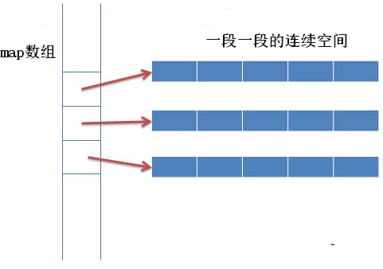

### deque简介

1. deque(发音类似“deck”)，是双端队列不规则的首字母缩写，双端队列是动态大小的序列式容器，其可以像两端进行伸缩
2. 特定的库可以以不同的方式实现deque，但通常都是一种动态数组。不论在何种情况下，它都允许通过 随机访问迭代器直接访问单个元素，可以根据需要动态的伸缩。
3. 因此，deque提供了一些与vector相似的功能，但deque在头部和尾部进行数据插入和删除操作更加高效。与vector不同的是，deque 不能保证所有的元素存储在连续的空间 中，在deque中通过指针加偏移 量方式访问元素可能会导致非法的操作。
4. vector与list提供了相似的接口，因此其具有类似的用途，但是内部的实现原理不同：vector使用使用了动态数组，该数组通常需要动态增长；deque中的元素可能分散在不同的存储块中，在deque中保存了 一些必要的信息，通常用来在常数范围内直接访问deque中的任何一个元素，所以deque的内部实现比 vector复杂，但是这些额外信息使得deque在某些情况下增长更加的高效，特别是在序列比较大，重新分 配成本比较高的情况下。
5. 除了在频繁在头部或尾部进行插入和删除操作外，deque比list和forward_list的性能更差。

### deque容器的存储结构

和 vector 容器采用连续的线性空间不同，deque 容器存储数据的空间是由一段一段等长的连续空间构成，各段空间之间并不一定是连续的，可以位于在内存的不同区域。

为了管理这些连续空间，deque 容器用数组（数组名假设为 map）存储着各个连续空间的首地址。也就是说，map 数组中存储的都是指针，指向那些真正用来存储数据的各个连续空间

 

通过建立 map 数组，deque 容器申请的这些分段的连续空间就能实现“整体连续”的效果。换句话说，当 deque 容器需要在头部或尾部增加存储空间时，它会申请一段新的连续空间，同时在 map 数组的开头或结尾添加指向该空间的指针，由此该空间就串接到了 deque 容器的头部或尾部。

如果 map 数组满了怎么办？

> 很简单，再申请一块更大的连续空间供 map 数组使用，将原有数据（很多指针）拷贝到新的 map 数组中，然后释放旧的空间。

deque 容器的分段存储结构，提高了在序列两端添加或删除元素的效率，但也使该容器迭代器的底层实现变得更复杂。

### deque容器迭代器的底层实现

由于 deque 容器底层将序列中的元素分别存储到了不同段的连续空间中，因此要想实现迭代器的功能，必须先解决如下 2 个问题：

1. 迭代器在遍历 deque 容器时，必须能够确认各个连续空间在 map 数组中的位置；
2. 迭代器在遍历某个具体的连续空间时，必须能够判断自己是否已经处于空间的边缘位置。如果是，则一旦前进或者后退，就需要跳跃到上一个或者下一个连续空间中。


为了实现遍历 deque 容器的功能，deque 迭代器定义了如下的结构：

```c++
template<class T,...>
struct __deque_iterator{
    ...
    T* cur;
    T* first;
    T* last;
    map_pointer node;//map_pointer 等价于 T**
}
```

可以看到，迭代器内部包含 4 个指针，它们各自的作用为：

- cur：指向当前正在遍历的元素；
- first：指向当前连续空间的首地址；
- last：指向当前连续空间的末尾地址；
- node：它是一个二级指针，用于指向 map 数组中存储的指向当前连续空间的指针。


借助这 4 个指针，deque 迭代器对随机访问迭代器支持的各种运算符进行了重载，能够对 deque 分段连续空间中存储的元素进行遍历。例如：

```c++
//当迭代器处于当前连续空间边缘的位置时，如果继续遍历，就需要跳跃到其它的连续空间中，该函数可用来实现此功能
void set_node(map_pointer new_node){
    node = new_node;//记录新的连续空间在 map 数组中的位置
    first = *new_node; //更新 first 指针
    //更新 last 指针，difference_type(buffer_size())表示每段连续空间的长度
    last = first + difference_type(buffer_size());
}
//重载 * 运算符
reference operator*() const{return *cur;}
pointer operator->() const{return &(operator *());}
//重载前置 ++ 运算符
self & operator++(){
    ++cur;
    //处理 cur 处于连续空间边缘的特殊情况
    if(cur == last){
        //调用该函数，将迭代器跳跃到下一个连续空间中
        set_node(node+1);
        //对 cur 重新赋值
        cur = first;
    }
    return *this;
}
//重置前置 -- 运算符
self& operator--(){
    //如果 cur 位于连续空间边缘，则先将迭代器跳跃到前一个连续空间中
    if(cur == first){
        set_node(node-1);
        cur == last;
    }
    --cur;
    return *this;
}
```

### deque容器的底层实现

了解了 deque 容器底层存储序列的结构，以及 deque 容器迭代器的内部结构之后，接下来看看 deque 容器究竟是如何实现的。

deque 容器除了维护先前讲过的 map 数组，还需要维护 start、finish 这 2 个 deque 迭代器。以下为 deque 容器的定义：

```c++
//_Alloc为内存分配器
template<class _Ty,
    class _Alloc = allocator<_Ty>>
class deque{
    ...
protected:
    iterator start;
    iterator finish;
    map_pointer map;
...
}
```

其中，start 迭代器记录着 map 数组中首个连续空间的信息，finish 迭代器记录着 map 数组中最后一个连续空间的信息。另外需要注意的是，和普通 deque 迭代器不同，start 迭代器中的 cur 指针指向的是连续空间中首个元素；而 finish 迭代器中的 cur 指针指向的是连续空间最后一个元素的下一个位置。

因此，deque 容器的底层实现如图 2 所示。

 

借助 start 和 finish，以及 deque 迭代器中重载的诸多运算符，就可以实现 deque 容器提供的大部分成员函数，比如：

```c++
//begin() 成员函数
iterator begin() {return start;}
//end() 成员函数
iterator end() { return finish;}
//front() 成员函数
reference front(){return *start;}
//back() 成员函数
reference back(){
    iterator tmp = finish;
    --tmp;
    return *tmp;
}
//size() 成员函数
size_type size() const{return finish - start;}//deque迭代器重载了 - 运算符
//enpty() 成员函数
bool empty() const{return finish == start;}
```

