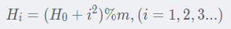
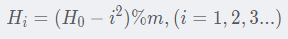
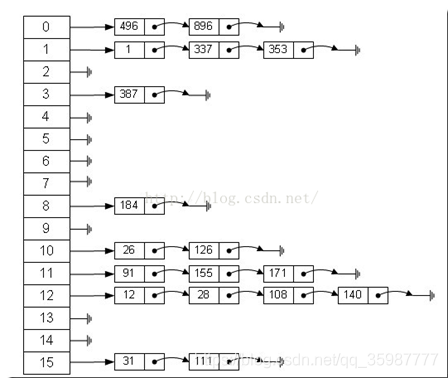

### 前言

unordered_map和 unordered_set是一种专门用来进行搜索的容器或者数据结构，因为其底层是哈希表，所以其增删查改的时间复杂度都是O（1），其效率是很高的。

### unordered_map

与map的区别：

1. unordered_map和map的功能类似，都是KV模型。
2. 底层不同，map的底层是红黑树，unordered_map的底层是哈希表。
3. map有排序的功能，而unordered_map是无序的。
4. 从效率上看，unordered_map增删查改的时间复杂度为O（1），而map增删查改的时间复杂度为O（logN）。
5. 从空间上看，unordered_map消耗的空间比map空间更大。
6. 使用场景：对数据有排序或者空间要求时，选择map；对效率有要求时，选择unordered_map。

### unordered_set

unordered_set和set都是K模型。因为它们的底层不同，所以其本质还是哈希表和红黑树的区别，区别在上面介绍unordered_map的时候谈到，这里不用过多篇幅。

### 哈希表

数组的特点是：寻址（查询）容易，插入和删除困难；

链表的特点是：寻址（查询）困难，插入和删除容易。

那么我们能不能综合两者的特性，做出一种寻址（查询）容易，插入删除也容易的数据结构，答案是肯定的，这就是我们要提起的哈希表 。
hash函数就是根据key计算出应该存储地址的位置，地址index=H（key），而哈希表是基于哈希函数建立的一种查找表。

### 哈希函数

#### 哈希函数的四个性质

1. 输入域是无穷的，输出域相对有限
2. 相同的输入值，一定输出相同的返回值
3. 不同的输入值，也可能输出相同的返回值（冲突）
4. 不同的输入，如果想得到整个输出域上的返回值，则整个输出域上的返回值是均匀分布的。举例：input[0,1,2…99], 经过哈希函数得到output[0,1,2],则映射到0，1，2的输入值个数大概是33，33，33。即均匀分布。同时对output输出的值域mod M后值域变成[0,1 2…M-1]，在新的值域上也是均匀分布的。

#### hash函数设计的考虑因素

1. 计算散列地址所需要的时间（即hash函数本身不要太复杂）
2. 关键字的长度
3. 表长
4. 关键字分布是否均匀，是否有规律可循
5. 设计的hash函数在满足以上条件的情况下尽量减少冲突

#### 哈希函数的构造方法

**直接定制法**

> 哈希函数为关键字的线性函数如 H（key）=a*key+b
> 这种构造方法优点比较简便，均匀，
> 缺点：需要事先知道关键字的分布情况
> 使用场景：适合查找比较小且连续的情况

**除留余数法**

> H（key）=key MOD p （p<=m m为表长）
> 很明显，如何选取p是个关键问题。
> 使用举例
> 比如我们存储3 6 9，那么p就不能取3
> 因为 3 MOD 3 == 6 MOD 3 == 9 MOD 3
> p应为不大于m的质数或是不含20以下的质因子的合数，这样可以减少地址的重复（冲突）

**平方取中法**

> 假设关键字为5432，对它平方就是29506624，抽取中间的3位506(或066)作为哈希地址
> 平方取中法比较适合：不知道关键字的分布，而位数又不是很大的情况

**折叠法**

> 折叠法是将关键字从左到右分割成位数相等的几部分(最后一部分位数可以短些)，然后将这几部分叠加求和，并按散列表表长，取后几位作为散列地址。
> 折叠法适合事先不需要知道关键字的分布，适合关键字位数比较多的情况

**随机数法**

> H(key) = random(key),其中random为随机数函数。
> 选择一个随机函数，取关键字的随机函数值为它的哈希地址
> 通常应用于关键字长度不等时采用此法

**数学分析法**

> 设有n个d位数，每一位可能有r种不同的符号，这r种不同的符号在各位上出现的频率不一定相同，可能在某些位上分布比较均匀，每种符号出现的机会均等，在某些位上分布不均匀只有某几种符号经常出现。可根据散列表的大小，选择其中各种符号分布均匀的若干位作为散列地址。
> 数字分析法通常适合处理关键字位数比较大的情况，如果事先知道关键字的分布且关键字的若干位分布较均匀的情况

### 著名的hash算法

* MD5
* SHA-1

### 哈希冲突

即不同key值产生相同的地址，H（key1）=H（key2）。

比如我们上面除留余数法作为哈希函数时，存储3 6 9，p取3时：`(3 MOD 3) == (6 MOD 3) == (9 MOD 3)`，此时3 6 9都发生了hash冲突。

### 哈希冲突解决方案

不管hash函数设计的如何巧妙，总会有特殊的key导致hash冲突，特别是对动态查找表来说。hash函数解决冲突的方法有以下几个常用的方法：

#### 开放定址法
当发生哈希冲突时，如果哈希表未被装满，说明在哈希表中必然还有空位置，那么可以把key存放到冲突位置中的“下一个” 空位置中去。那如何寻找下一个空位置呢？

a. 线性探测
线性探测：从发生冲突的位置开始，依次向后探测，直到寻找到下一个空位置为止。
线性探测优点：实现非常简单，
线性探测缺点：一旦发生哈希冲突，所有的冲突连在一起，容易产生数据“堆积”，即：不同关键码占据了可利用的空位置，使得寻找某关键码的位置需要许多次比较，导致搜索效率降低。

b. 二次探测
二次探测为了避免线性探测中找空位置的时挨着往后逐个去找导致数据堆积的问题。
把找下一个空位置的方法改为：
 

或者：

 

其中H_0是通过哈希函数Hash(key)计算得到的。

> 研究表明：当表的长度为质数且表装载因子a不超过0.5时，新的表项一定能够插入，而且任何一个位置都不会被探查两次。因此只要表中有一半的空位置，就不会存在表满的问题。在搜索时可以不考虑表装满的情况，但在插入时必须确保表的装载因子a不超过0.5，如果超出必须考虑增容。

**装载因子load factor = 哈希表的大小 / 有效元素的个数**，负载因子越小，出现哈希冲突的概率越低，哈希表的效率越高，但是浪费的空间越多

#### 链地址法
链地址法又叫开链法/哈希桶/拉链法，
首先对key用散列函数计算散列地址，具有相同地址的关键码归于同一子集合，每一个子集合称为一个桶，各个桶中的元素通过一个单链表链接起来，各链表的头结点存储在哈希表中。

 

#### 再散列法
准备若干个hash函数，如果使用第一个hash函数发生了冲突，就使用第二个hash函数，第二个也冲突，使用第三个……

#### 公共溢出区法
建立一个特殊存储空间，专门存放冲突的数据。此种方法适用于数据和冲突较少的情况。