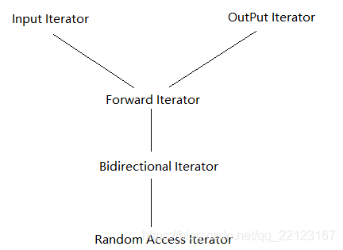

### 迭代器

1. 迭代器是一种抽象的，能够提供一种访问容器每个元素且不暴露容器内部实现的一种方式方法
2. 在stl的设计中，迭代器起着一种粘着剂的作用，用以联系容器与算法，避免同一个算法却因为容器不一而设计多套。
3. 迭代器形式指针，最重要的功能便是内容提领(dereference)和成员访问(member access)。

### traits编程技法

迭代器中不得不提到的就是traits技法。

> 迭代器的设计要点之一就是尽量的封装容器的实现细节，其中也就包括了容器元素的类型，那么当迭代器作为中间粘着剂传入算 法中，算法也是无法得知具体元素的类型，也就无法做出相应的处理。所以需要有一种机制，能够获取得到元素的类型。

#### 方式一

> 利用function template参数推到的形式在方法内获取到元素类型，并且可以使用声明新的变量。
>
> 缺陷：当需此型别用于函数返回值时则束手无策。

```c++
template <class I, class T>

void test_impl(I iT t) {
    T a;
}

void test(I i) {
   test_impl(i, *i)
}

int main() {
    int i = 0;
    test(&i);
}
```

#### 方式二

> 内嵌型别声明。由此可以使用元素的类型作为返回值型别使用，而且在使用I::value_type时必须加上typename，因为T是一个template参数，在它被编译器具现化之前，编译器对其一无所知，关键词typename的用意在于告诉编译器这是一个型别，如此才能通过编译。
>
> 缺陷：此方法无法对非class type迭代器声明型别，如指针，需要对指针类型做特殊化的处理。

```c++
template<class T>

struct Iter {

typedef T value_type;

}

template<class I>

typename I::value_type test(I iter) {

    return *iter;

}
```

### 模板偏特化

在泛化设计之中针对某些模板参数进行明确的指定，达到对该指定类型的特殊化甄别处理。

```c++
template<class T>
class C<T> {}
```

当T为指针时的处理:

```c++
template<class T>
class C<T*> {}
```

### 萃取

基于模板偏特化的思想，可以给内嵌型别声明的方式添加一个中间层，使得内嵌型别声明的方式拥有处理原生指针的偏特化版本。

```c++
class type:
template<class I>
struct iter_traits {
	typedef typename I::value_type;
}
```

### 原生指针

```c++
template<class T>
struct iter_traits<T*> {
	typedef T value_type;
}

// 使用方式：
template<class I>
typename iter_traits<I>::value_type test(I iter) {
	return *iter;
}
```

class type及原生指针的编码方式统一。对于以上所述的萃取机制，每个STL的迭代器都必须遵守该编码规则。

### 常用迭代器型别

```c++
template <class Iterator>
struct iterator_traits
{
    typedef typename Iterator::iterator_category iterator_category;
    typedef typename Iterator::value_type value_type;
    typedef typename Iterator::difference_type difference_type;
    typedef typename Iterator::pointer pointer;
    typedef typename Iterator::reference reference;
};
```

1. value_type:迭代器所指对象的型别。

2. difference_type：用来表示两个迭代器之间的距离。

3. reference：引用型别，返回左值。

4. pointer：指针类型

5. iterator_category：迭代器类型

### 迭代器分类

* Input iterator(输入迭代器)
  * 读, 不能写
  * 只支持自增运算
* Output iterator(输出迭代器) 
  * 写，不能读
  * 只支持自增运算
* Forward iterator(前向迭代器) 
  * 读和写
  * 只支持自增运算
* Bidirectional iterator(双向迭代器)
  * 读和写
  * 支持自增和自减运算
* Random access iterator(随机访问迭代器)
  * 读和写
  * 支持完整的迭代器算术运算

### 迭代器分类从属关系

 

 ### 问题

当一个算法遇到不同类型的迭代器的时候，应当使用不同的处理手段，以算法advance为例。

* 对于input类型，比如单向链表，advance(iter, n),就必须向后遍历n个元素。
* 然而对于Random Access Iterator，如数组，只需要当前位置+n即可。
* 所以，当一个算法处理传入的迭代器时，不仅要获取其型别，而且要得知其类型，iterator_category便为此而生。

### 标记类别

STL选择使用函数的重载机制来实现不同迭代器类型的算法版本。

定义五个作为标记的型别：

```c++
struct input_iterator_tag{};
struct output_iterator_tag{};
struct forwrd_iterator_tag : public input_iterator_tag{};
struct bidirectional_iterator_tag : public forward_iterator_tag {};
struct random_access_iterator_tag : public bidirectional_iterator_tag {};
```

第三个参数只作为重载标识

```c++
template<class T, class N>
void testImpl(T t, N n, input_iterator_tag);
void testImpl(T t, N n, output_iterator_tag);
void testImpl(T t, N n, forward_iterator_tag );
void testImpl(T t, N n, bidirectional_iterator_tag );
void testImpl(T t, N n, random_access_iterator_tag );
```

传入时候就可以使用：

```c++
template<class T, class N>
void test(T t , N n) {
	// T 自己的萃取器 iter_traits 
    typedef typename iter_traits <T>::iterator_category category;
    testImpl(t, n, category);
}
```

至此迭代器完成了其内容提领(dereference)和成员访问(member access)的功能。