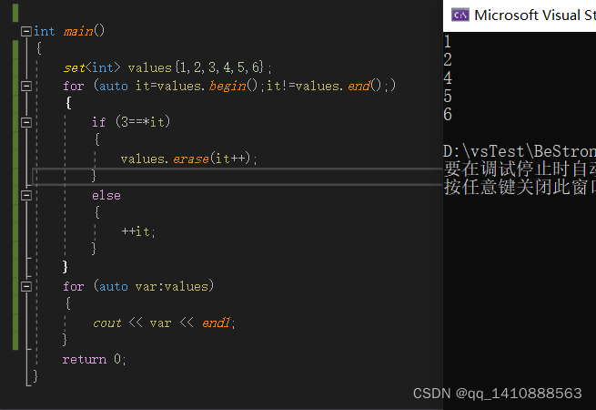
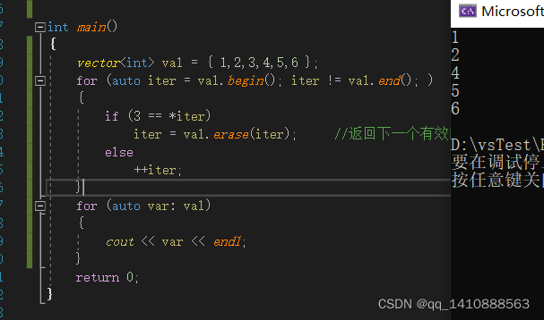

### 何谓迭代器失效
迭代器失效是一种现象，由特定操作引发，这些特定操作对容器进行操作，使得迭代器不指向容器内的任何元素，或者使得迭代器指向的容器元素发生了改变。

【Note】后一种取决于编译器，部分编译器会将此种情况也视为迭代器失效，部分编译器并不视为失效）

### 可能引起迭代器失效的操作
因为不同的容器，迭代器不尽相同。

可以引起vector迭代器失效的相同操作不一定会导致list的迭代器失效。

可能引起迭代器失效的操作

1. 插入元素/扩容引起的迭代器指向的元素或者空间发生变化，导致迭代器失效
2. 删除元素使得某些元素次序发生变化使得原本指向某元素的迭代器不再指向希望指向的元素。
3. 容器空间被释放导致存放原容器元素的空间不再有效，使得指向原空间的迭代器失效。
4. 容器元素整体“迁移”导致存放原容器元素的空间不再有效，使得指向原空间的迭代器失效。
   

### list的迭代器失效

list迭代器失效的操作只有`erase`(删除)操作，且失效的迭代器仅仅是被删除节点的迭代器，其他迭代器并不受影响，依然有效。

解决办法：

> 返回值都是被删节点的后继节点的迭代器，我们在删除后，需要的话可以利用这个返回值进行后续操作。

### vector的迭代器失效

vector的底层是可动态扩容的数组，该数组插入/删除元素都会引起插入/删除位置之后的元素发生挪动。删除会使删除位置之后的元素全部前移，插入会使插入位置之后的元素全部后移。因此删除/插入操作都会使被操作的元素对应的迭代器失效，会导致操作位置之后的迭代器全部失效！

如何解决vector的迭代器失效问题？

> 牢记这些可能导致迭代器失效的操作，在使用迭代器前，牢记更新迭代器（重新赋值）即可。

### 容器对应迭代器失效

容器分类：

1. 关联式容器：map， set

2. 顺序式容器：vector，list，deque，forward_list , string

1. 节点式（连续内存）；vector，deque , string
2. 非节点式（非连续内存）：map， set，list， forward_list

通常有三条规则：
1. 对于节点式容器(map, list, set)元素的删除，会导致指向该元素的迭代器失效，其他元素迭代器不受影响， 插入操作不会导致迭代器失效
2. 对于非节点式容器(vector，string，deque)元素的删除、插入操作会导致指向该元素以及后面的元素的迭代器失效

### 处理方式

处理节点式容器失效方法：

 

处理非节点式容器失效方法：

 