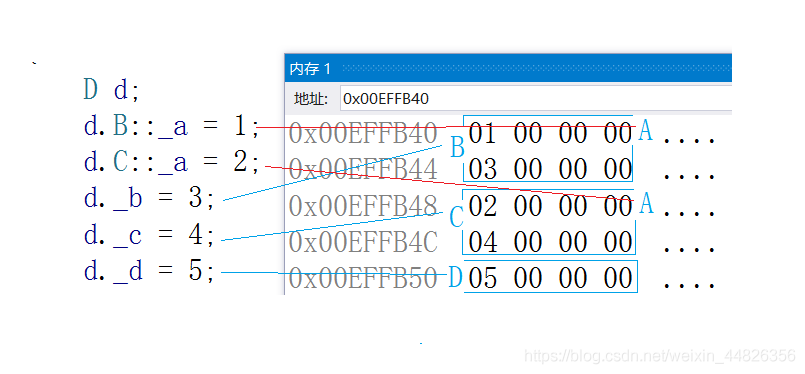

#### 1. 什么是菱形继承？菱形继承的问题是什么？

**菱形继承**：菱形继承是多继承一种特殊的继承方式。如下如所示为一菱形继承 


 即两个派生类继承同一个基类，同时两个派生类又作为基本继承给同一个派生类。这种继承形如菱形，故又称为菱形继承。

**菱形继承的问题**：菱形继承主要有数据冗余和二义性的问题。由于最底层的派生类继承了两个基类，同时这两个基类有继承的是一个基类，故而会造成最顶部基类的两次调用，会造成数据冗余及二义性问题。如下图所示，在Assistant的对象中Person成员会有两份。


```javascript
class Person//人类
{
	public :
	string _name ; // 姓名
};
class Student : public Person//学生类
{
protected :
    int _num ; //学号
};
class Teacher : public Person//老师类
{
protected :
    int _id ; // 职工编号
};
class Assistant : public Student, public Teacher//助理类
{
protected :
    string _majorCourse ; // 主修课程
};
void Test ()
{
    // 这样会有二义性无法明确知道访问的是哪一个
    Assistant a ;
    a._name = "peter";
    
    // 需要显示指定访问哪个父类的成员可以解决二义性问题，但是数据冗余问题无法解决
    a.Student::_name = "xxx";
    a.Teacher::_name = "yyy";
}
```

#### 2. 什么是菱形虚拟继承？如何解决数据冗余和二义性的？

**虚拟继承**可以解决菱形继承的二义性和数据冗余的问题。如上面的继承关系，在Student和Teacher的继承Person时使用虚拟继承，即可解决问题。需要注意的是，虚拟继承不要在其他地方去使用。

```javascript
class Person
{
public :
    string _name ; // 姓名
};
class Student : virtual public Person
{
protected :
    int _num ; //学号
};
class Teacher : virtual public Person
{
protected :
    int _id ; // 职工编号
};
class Assistant : public Student, public Teacher
{
protected :
    string _majorCourse ; // 主修课程
};
void Test ()
{

    Assistant a ;
    a._name = "peter";
}
```

复制

###### 虚拟继承解决数据冗余和二义性的原理

```javascript
class A
{
public:
    int _a;
};
 
// class B : public A
class B : virtual public A
{
public:
    int _b;
};
 
// class C : public A
class C : virtual public A
{
public:
    int _c;
};
 
class D : public B, public C
{
public:
    int _d;
};
 
int main()
{
    D d;
    d.B::_a = 1;
    d.C::_a = 2;
    d._b = 3;
    d._c = 4;
    d._d = 5;
 
    return 0;
}
```

复制

下图是菱形虚拟继承的内存对象成员模型：这里可以分析出D对象中将A放到的了对象组成的最下面，这个A同时属于B和C，那么B和C如何去找到公共的A呢？这里是**通过了B和C的两个指针，指向的一张表。这两个指针叫虚基表指针，这两个表叫虚基表。虚基表中存的偏移量。通过偏移量可以找到下面的A。** 


#### 3. 继承和组合的区别？什么时候用继承？什么时候用组合？

- public继承是一种is-a的关系。也就是说**每个派生类对象都是一个基类对象**。
- 组合是一种has-a的关系。假设B组合了A，每个B对象中都有一个A对象。
- 优先使用对象组合，而不是类继承 。
- 继承允许你**根据基类的实现来定义派生类的实现**。这种通过生成派生类的复用通常被称为白箱复用(white-box reuse)。术语“白箱”是相对可视性而言：在继承方式中，基类的内部细节对子类可见 。
- **继承一定程度破坏了基类的封装**，基类的改变，对派生类有很大的影响。派生类和基类间的依赖关系很强，耦合度高。
- 对象组合是类继承之外的另一种复用选择。新的更复杂的功能可以通过组装或组合对象来获得。对象组合要求被组合的对象具有良好定义的接口。这种复用风格被称为黑箱复用(black-box reuse)，因为对象的内部细节是不可见的。对象只以“黑箱”的形式出现。 组合类之间没有很强的依赖关系，耦合度低。优先使用对象组合有助于你保持每个类被封装。
- 实际尽量多去用组合。组合的耦合度低，代码维护性好。不过继承也有用武之地的，有些关系就适合继承那就用继承，另外要实现多态，也必须要继承。类之间的关系可以用继承，可以用组合，就 用组合。

#### 4. c++之哪些成员函数不能被继承

1. 构造函数：在创建子类对象时，为了初始化从父类继承来的数据成员，**系统需要调用其父类的构造方法**。如果没有显式的构造函数，编译器会给一个默认的构造函数，并且该默认的构造函数仅仅在没有显式地声明构造函数情况下创建。
2. 析构函数：**析构函数也不会被子类继承，只是在子类的析构函数中会调用父类的析构函数**。
3. 运算符重载赋值函数：赋值运算符重载函数也不会被子类继承，只是在子类的赋值运算符重载函数中会调用父类的赋值运算符重载函数。