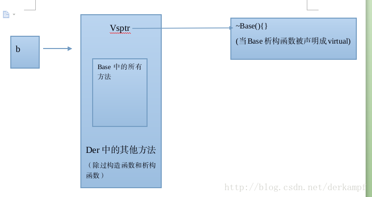

### 虚析构函数的作用
总的来说虚析构函数是为了避免内存泄露，而且是当子类中会有指针成员变量时才会使用得到的。也就说**虚析构函数使得在删除指向子类对象的基类指针时可以调用子类的析构函数达到释放子类中堆内存的目的，而防止内存泄露的**.

我们知道，用C++开发的时候，用来做基类的类的析构函数一般都是虚函数。可是，为什么要这样做呢？下面用一个小例子来说明：

```cpp

#include<iostream>
using namespace std;
 
class ClxBase
{
    public:
        ClxBase() {};
        virtual ~ClxBase() { cout<<"delete ClxBase"<<endl; };
 
        virtual void DoSomething() { cout << "Do something in class ClxBase!" << endl;  };
 
};
 
class ClxDerived : public ClxBase
{
    public:
        ClxDerived() {};
        ~ClxDerived() { cout << "Output from the destructor of class ClxDerived!" << endl;  };
 
        void DoSomething() { cout << "Do something in class ClxDerived!" << endl;  };
 
};
 
int main(int argc, char const* argv[])
{
     ClxBase *pTest = new ClxDerived;
     pTest->DoSomething();
     delete pTest;
     return 0;
}
```

 
但是，如果把类ClxBase[析构函数](https://so.csdn.net/so/search?q=析构函数&spm=1001.2101.3001.7020)前的virtual去掉，那输出结果就是下面的样子了： 
 
没有调动子类的析构函数 
也就是说，类ClxDerived的析构函数根本没有被调用！一般情况下类的析构函数里面都是释放内存资源，而析构函数不被调用的话就会造成内存泄漏。我想所有的C++程序员都知道这样的危险性。当然，如果在析构函数中做了其他工作的话，那你的所有努力也都是白费力气。 
所以，文章开头的那个问题的答案就是－－这样做是为了当用一个基类的指针删除一个派生类的对象时，派生类的析构函数会被调用。 
当然，并不是要把所有类的析构函数都写成[虚函数](https://so.csdn.net/so/search?q=虚函数&spm=1001.2101.3001.7020)。因为当类里面有虚函数的时候，编译器会给类添加一个虚函数表，里面来存放虚函数指针，这样就会增加类的存储空间。所以，只有当一个类被用来作为基类的时候，才把析构函数写成虚函数。

**总结一下虚析构函数的作用：** 
（1）**如果父类的析构函数不加virtual关键字** 
当父类的析构函数不声明成虚析构函数的时候，当子类继承父类，父类的指针指向子类时，delete掉父类的指针，只调动父类的析构函数，而不调动子类的析构函数。 
（2）**如果父类的析构函数加virtual关键字** 
当父类的析构函数声明成虚析构函数的时候，当子类继承父类，父类的指针指向子类时，delete掉父类的指针，先调动子类的析构函数，再调动父类的析构函数。 

### 虚析构函数的原理分析

```cpp

#include<iostream>
using namespace std;
 
class Base
{
public:
    Base(){cout<<"create Base"<<endl;}
    virtual ~Base(){cout<<"delete Base"<<endl;}
};
 
class Der : public Base
{
public:
    Der(){cout<<"create Der"<<endl;}
    ~Der(){cout<<"Delete Der"<<endl;}
};
 
int main(int argc, char const* argv[])
{
    Base *b = new Der;
    delete b;
 
    return 0;
}

```

从创建讲起，用gdb调试你会发现， 
（1）先调用父类的构造函数，再调用子类的构造函数，

> 这里有一个问题:父类的构造函数/析构函数与子类的构造函数/析构函数会形成多态，但是当父类的构造函数/析构函数即使被声明virtual，子类的构造/析构方法仍无法覆盖父类的构造方法和析构方法。这是由于父类的构造函数和析构函数是子类无法继承的，也就是说每一个类都有自己独有的构造函数和析构函数。

（2）而由于父类的析构函数为虚函数，所以子类会在所有属性的前面形成虚表，而虚表内部存储的就是父类的虚函数

> 即使子类也有虚函数，但是由于是单继承，所以也只有一张虚表，这在上一篇博客[多态](http://blog.csdn.net/derkampf/article/details/62046205)中讲到过。 
> 执行 Base *b = new Der;之后b的最终形态 
> 

（3）当delete父类的指针时，由于子类的析构函数与父类的析构函数构成多态，所以得先调动子类的析构函数；之所以再调动父类的析构函数，是因为delete的机制所引起的,delete 父类指针所指的空间，要调用父类的析构函数。 
所以结果就是这样 
