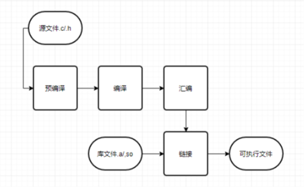

在编程的过程中，使用已经封装好的库函数是十分方便的，也是十分高效的，因此会使用函数库是很重要的。在C语言中，函数库文件分为两种类型，一种是静态库（库程序是直接注入目标程序的，不分彼此，库文件通常以.a结尾），另一种是动态库（库程序是在运行目标程序时（中）加载的，库文件通常以.so结尾），下面我们就探索一下这两种库文件的特点和使用方式吧！

### 背景知识

我们要先了解一下源文件到可执行文件的编译过程如下图：

 

### 预编译

预编译是使用预编译器cpp进行处理.c源文件和.h头文件，最终生成一个.i的文件。预编译过程就是处理源代码中以#开头的预编译指令，如#include  #define 等。预编译过程等价于如下命令：

```bash
gcc -E hello.c -o hello.i  
或者   
cpp hello.c > hello.i 
```

\#include 就是将包含的头文件全部展开到#include的位置，所以一个.c源文件如果包含多个头文件，头文件的顺序是需要注意的地方。

### 编译

编译的过程就是将 预处理 完的文件进行一系列的词法分析、语法分析、语义分析及优化，最后生成 .s 汇编代码文件。编译过程等价如下命令：

```bash
gcc -S hello.i -o hello.s    
```

编译过程是整个程序构建的核心部分，也是最复杂的部分之一。

### 汇编

汇编器是将汇编代码转变成机器可以执行的指令， 每一条汇编代码几乎都对应着一条机器指令。最后生成一个 .o 目标文件。汇编过程等价如下命令：

```bash
gcc -c hello.s -o hello.o    
或者
as hello.s -o hello.o
```

汇编器的汇编过程相对简单一些，只需要根据汇编指令和机器指令对照表一一翻译就可以了。

### 链接

链接的作用就是我们这篇文章的重点，就是将我们编译出来的目标文件和我们代码所用到的库文件一起打包成一个可执行文件的过程。例如hello.c中的打印函数printf，这个函数不是凭空出现的，在链接的过程中就要连同对应库文件一起打包，最终可执行文件才能正常运行。

### 静态库VS动态库

静态库和动态库的载入时间是不一样的。

静态库的代码在编译的过程中已经载入到可执行文件中，所以最后生成的可执行文件相对较大。

动态库的代码在可执行程序运行时才载入内存，在编译过程中仅简单的引用，所以最后生成的可执行文件相对较小。

静态库和动态库的最大区别是，静态库链接的时候把库直接加载到程序中,而动态库链接的时候，它只是保留接口，将动态库与程序代码独立，这样就可以提高代码的可复用度和降低程序的耦合度。

静态库在程序编译时会被连接到目标代码中，程序运行时将不再需要该静态库。

动态库在程序编译时并不会被连接到目标代码中，而是在程序运行是才被载入，因此在程序运行时还需要动态库存在。

无论静态库，还是动态库，都是由.o文件创建的。因此，我们必须将源程序hello.c通过gcc先编译成.o文件。

### 静态库

静态库的名字一般是libxxx.a 在编译的时候直接编译进可执行文件中，运行环境中可以不用存在库文件，但是如果库文件更新了，可执行文件需要重新编译。

### 操作静态库

Linux下使用ar命令进行操作静态库：

```bash
ar  archivefile  objfile
archivefile：	archivefile是静态库的名称
objfile：      	objfile是已.o为扩展名的中间目标文件名，可以多个并列

参数     意义
-r      将objfile文件插入静态库尾或者替换静态库中同名文件
-x      从静态库文件中抽取文件objfile
-t      打印静态库的成员文件列表
-d      从静态库中删除文件objfile
-s      重置静态库文件索引
-v      创建文件冗余信息
-c      创建静态库文件
```

### 编译静态库

在编译成静态库之前，我们需要将源文件编译一下，生成一个 .o 文件的目标文件。例如写了一个打印helloworld的接口，我们要先执行：

```bash
gcc -c hello.c
ar crv libhello.a hello.o
```

第一条命令是生成目标文件hello.o ，第二条命令是将目标文件hello.o 打包成静态库文件libhello.a。

### 链接静态库

上面我们说了静态库是如何生成的，然后我们说一下静态库怎么使用。静态库是要编译进可执行文件的，在程序运行的环境中，并不需要静态库的存在。比如我们生成的静态库文件是libhello.a  需要编译的文件是main.c。编译命令如下：

```bash
gcc main.c -L . -lhello 
```

解读一下： -L 后面是静态库文件所在的目录，我这里 . 就是指当前目录的意思。也就是库文件就和源文件在同一路径。真正编译的时候，这个路径还是要填绝对路径要好，这个需要注意一下。后面的-l加上库名，这个库名是去掉lib和后面的.a。静态库的链接就是这样的。

### 动态库

动态库中的代码是可执行文件在运行中加载执行的，也就是说 程序运行环境中要有动态库文件。一般动态库文件命名为lib***.so。动态库的优点就是方便升级，动态库变化了，可执行文件不用重新编译。

### 编译动态库

还拿hello.c来说，使用下面的命令就可以生成一个动态库文件libhello.so 。看一下各个参数的含义。

```bash
 gcc -fPIC -shared -o libhello.so hello.c
```

 -fPIC 是创建与地址无关的编译程序（pic，position independent code），是为了能够在多个应用程序间共享。-shared指定生成动态链接库。

### 调用动态库态库

我们在运行环境中直接运行可执行文件，前提动态库文件也在运行环境中。需要注意的是 系统在运行程序的时候，需要知道动态库的名称和位置，这样才能加载，如果找不到动态库就会直接程序退出报错。

所以在编译程序的时候使用下面方式编译：

```bash
gcc mian.c -o mian -L ./ -lhello
```

同样，-L后面是库文件的路径，最好是用绝对路径。-l加上去掉lib的库名。然后直接执行可执行文件就可以了。

还用一种使用动态库的方式是： 

linux提供dlopen、dlsym、dlerror和dlcolose函数获取动态链接库的函数。通过这个四个函数可以实现一个插件程序，方便程序的扩展和维护。函数格式如下所示：

```c
#include <dlfcn.h>

void *dlopen(const char *filename, int flag);
char *dlerror(void);
void *dlsym(void *handle, const char *symbol);
int dlclose(void *handle);
Link with -ldl.
```

就是使用这些函数去找对应的库函数入口地址，然后去执行。具体详细内容可自行Google学习。