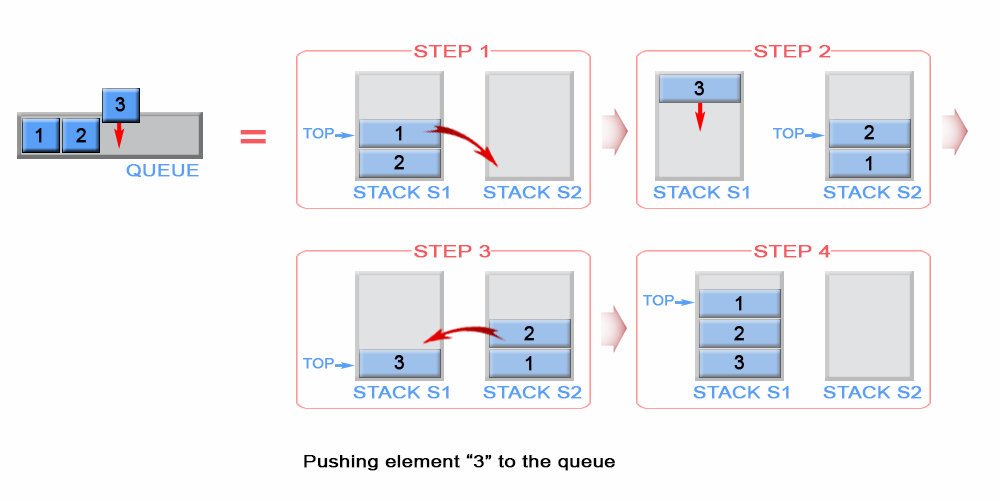

### 题解
队列是一种 先进先出（first in - first out， FIFO）的数据结构，队列中的元素都从后端（rear）入队（push），从前端（front）出队（pop）。
实现队列最直观的方法是用链表，但在这篇文章里我会介绍另一个方法 - 使用栈。
栈是一种 后进先出（last in - first out， LIFO）的数据结构，栈中元素从栈顶（top）压入（push)，也从栈顶弹出（pop）。
为了满足队列的 FIFO 的特性，我们需要用到两个栈，用它们其中一个来反转元素的入队顺序，用另一个来存储元素的最终顺序。

#### 方法一

> 使用两个栈 入队 - O(n)， 出队 - O(1)

##### 入队（push）

一个队列是 FIFO 的，但一个栈是 LIFO 的。这就意味着最新压入的元素必须得放在栈底。为了实现这个目的，我们首先需要把 s1 中所有的元素移到 s2 中，接着把新元素压入 s2。最后把 s2 中所有的元素弹出，再把弹出的元素压入 s1。



```java
private int front;

public void push(int x) {
    if (s1.empty())
        front = x;
    while (!s1.isEmpty())
        s2.push(s1.pop());
    s2.push(x);
    while (!s2.isEmpty())
        s1.push(s2.pop());
}
```

复杂度分析：

* 时间复杂度：O(n)

  > 对于除了新元素之外的所有元素，它们都会被压入两次，弹出两次。新元素只被压入一次，弹出一次。这个过程产生了 4n + 24n+2 次操作，其中 n 是队列的大小。由于 压入 操作和 弹出 操作的时间复杂度为 O(1)， 所以时间复杂度为 O(n)。

* 空间复杂度：O(n)

  > 需要额外的内存来存储队列中的元素。

##### 出队（pop）

直接从 s1 弹出就可以了，因为 s1 的栈顶元素就是队列的队首元素。同时我们把弹出之后 s1 的栈顶元素赋值给代表队首元素的 front 变量。


```java
// Removes the element from the front of queue.
public void pop() {
    s1.pop();
    if (!s1.empty())
        front = s1.peek();
}
```

复杂度分析：

* 时间复杂度：O(1)
* 空间复杂度：O(1)

##### 判断空（empty）

s1 存储了队列所有的元素，所以只需要检查 s1 的是否为空就可以了。

```java
// Return whether the queue is empty.
public boolean empty() {
    return s1.isEmpty();
}
```

复杂度分析：

* 时间复杂度：O(1)
* 空间复杂度：O(1)

##### 取队首元素（peek）

在我们的算法中，用了 front 变量来存储队首元素，在每次 入队 操作或者 出队 操作之后这个变量都会随之更新。

```java
// Get the front element.
public int peek() {
  return front;
}
```

复杂度分析：

* 时间复杂度：O(1)

  > 队首元素（front）已经被提前计算出来了，同时也只有 peek 操作可以得到它的值。

* 空间复杂度：O(1)

#### 方法二

> 使用两个栈 入队 - O(1)，出队 - 摊还复杂度 O(1)

##### 入队（push）

新元素总是压入 s1 的栈顶，同时我们会把 s1 中压入的第一个元素赋值给作为队首元素的 front 变量。

 

```java
private Stack<Integer> s1 = new Stack<>();
private Stack<Integer> s2 = new Stack<>();

// Push element x to the back of queue.
public void push(int x) {
    if (s1.empty())
        front = x;
    s1.push(x);
}
```

**复杂度分析:**

* 时间复杂度：O(1)

  > 向栈压入元素的时间复杂度为O(1)

* 空间复杂度：O(n)

  > 需要额外的内存来存储队列元素

##### 出队（pop）

根据栈 LIFO 的特性，s1 中第一个压入的元素在栈底。为了弹出 s1 的栈底元素，我们得把 s1 中所有的元素全部弹出，再把它们压入到另一个栈 s2 中，这个操作会让元素的入栈顺序反转过来。通过这样的方式，s1 中栈底元素就变成了 s2 的栈顶元素，这样就可以直接从 s2 将它弹出了。一旦 s2 变空了，我们只需把 s1 中的元素再一次转移到 s2 就可以了。

 


```Java
// Removes the element from in front of queue.
public void pop() {
    if (s2.isEmpty()) {
        while (!s1.isEmpty())
            s2.push(s1.pop());
    }
    s2.pop();    
}
```

**复杂度分析:**

* 时间复杂度： 摊还复杂度 O(1)，最坏情况下的时间复杂度 O(n)

  > 在最坏情况下，s2 为空，算法需要从 s1 中弹出 nn 个元素，然后再把这 nn 个元素压入 s2，在这里n代表队列的大小。这个过程产生了 2n 步操作，时间复杂度为 O(n)。但当 s2 非空时，算法就只有 O(1)的时间复杂度。所以为什么叫做摊还复杂度 O(1)呢？ 读了下一章你就知道了。

* 空间复杂度 ：O(1)

**摊还分析**

摊还分析给出了所有操作的平均性能。摊还分析的核心在于，最坏情况下的操作一旦发生了一次，那么在未来很长一段时间都不会再次发生，这样就会均摊每次操作的代价。

来看下面这个例子，从一个空队列开始，依次执行下面这些操作：

```bash
push1, push2, push3, ... pushN, pop1, pop2, pop3, popN
```

单次 出队 操作最坏情况下的时间复杂度为 O(n)。考虑到我们要做 nn 次出队操作，如果我们用最坏情况下的时间复杂度来计算的话，那么所有操作的时间复杂度为 O(n^2)。

然而，在一系列的操作中，最坏情况不可能每次都发生，可能一些操作代价很小，另一些代价很高。因此，如果用传统的最坏情况分析，那么给出的时间复杂度是远远大于实际的复杂度的。例如，在一个动态数组里面只有一些插入操作需要花费线性的时间，而其余的一些插入操作只需花费常量的时间。

在上面的例子中，出队 操作最多可以执行的次数跟它之前执行过 入队 操作的次数有关。虽然一次 出队 操作代价可能很大，但是每 n 次 入队 才能产生这么一次代价为 n 的 出队 操作。因此所有操作的总时间复杂度为：n(所有的入队操作产生） + 2 * n(第一次出队操作产生） + n - 1(剩下的出队操作产生）， 所以实际时间复杂度为 O(2*n)。于是我们可以得到每次操作的平均时间复杂度为 O(2n/2n)=O(1)。

##### 判断空（empty）

s1 和 s2 都存有队列的元素，所以只需要检查 s1 和 s2 是否都为空就可以了。

```Java
// Return whether the queue is empty.
public boolean empty() {
    return s1.isEmpty() && s2.isEmpty();
}
```


复杂度分析：

* 时间复杂度：O(1)
* 空间复杂度：O(1)

##### 取队首元素（peek)

我们定义了 front 变量来保存队首元素，每次 入队 操作我们都会随之更新这个变量。当 s2 为空，front 变量就是队首元素，当 s2 非空，s2 的栈顶元素就是队首元素。

``` Java
// Get the front element.
public int peek() {
    if (!s2.isEmpty()) {
        return s2.peek();
    }
    return front;
}
```

**复杂度分析：**

* 时间复杂度：O(1)

  > 队首元素要么是之前就被计算出来的，要么就是 s2 栈顶元素。因此时间复杂度为 O(1)。

* 空间复杂度：O(1)