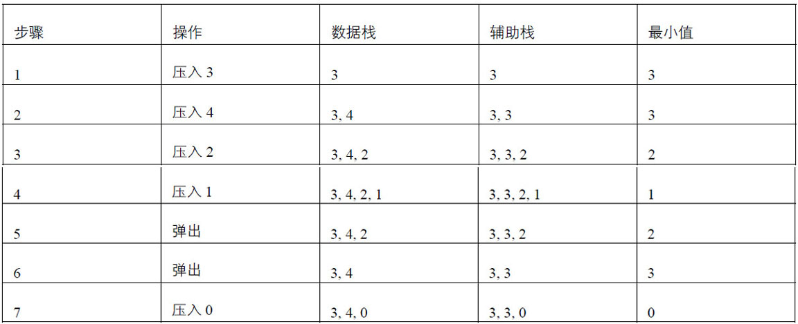

### 题目

定义栈的数据结构，请在该类型中实现一个能够得到栈的最小元素的min函数。在该栈中，调用min、push及pop的时间复杂度都是O(*1*)。

这里我们要实现的就是min、push以及pop三个方法：

```java
public class MinInStack<T> where T : struct
{
    private Stack<T> dataStack;
    private Stack<T> minStack;

    public MinInStack()
    {
        this.dataStack = new Stack<T>();
        this.minStack = new Stack<T>();
    }

    public bool IsEmpty()
    {
        return this.dataStack.Count == 0;
    }

    public T Top()
    {
        return this.dataStack.Peek();
    }

    public void Push(T item)
    {
    }

    public T Pop()
    {
    }

    public T Min()
    {
    }
}
```

### 题解

#### 核心步骤

把每次的最小元素（之前的最小元素和新压入栈的元素两者的较小值）都保存起来放到另外一个**辅助栈**里。下图展示了栈内压入3、4、2、1之后接连两次弹出栈顶数字再压入0时，数据栈、辅助栈和最小值的状态。



从表中我们可以看出，如果**每次都把最小元素压入辅助栈，那么就能保证辅助栈的栈顶一直都是最小元素**。

#### Push方法

```java
public void Push(T item)
{
    // 把新元素添加到数据栈
    dataStack.Push(item);
    // 当新元素比之前的最小元素小时，把新元素插入辅助栈里；
    // 否则把之前的最小元素重复插入辅助栈里
    if (minStack.Count == 0 || item.CompareTo(minStack.Peek()) < 0)
    {
        minStack.Push(item);
    }
    else
    {
        minStack.Push(minStack.Peek());
    }
}
```

#### Pop方法

```java
public T Pop()
{
    T item = dataStack.Pop();
    if(minStack.Count > 0)
    {
        minStack.Pop();
    }

    return item;
}
```

#### Min方法

```java
public T Min()
{
	return minStack.Peek();
}
```