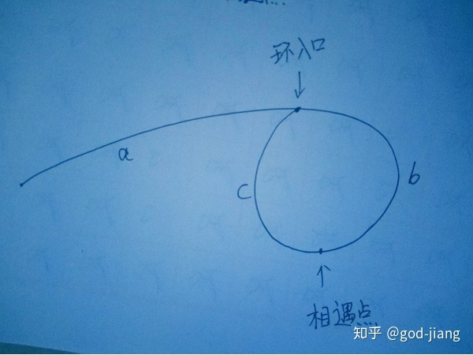

### 题目描述

> 给定一个链表，若其中包含环，请找出该链表的环的入口节点，否则，输出null。

### 思路

> 设置快慢指针，都从链表头出发，快指针每次**走两步，**慢指针一次**走一步，**假如有环，一定相遇于环中某点（结论1）.接着让两个指针分别从相遇点和链表头出发，两者都改为每次**走一步**，最终相遇于环入口（结论2）。以下是两个结论的证明：

### 两个结论

1. **设置快慢指针，假如有环，他们最后一定相遇在环中。**
2. **两个指针相遇后，让两个指针分别从链表头和相遇点重新出发，每次走一步，最后一定相遇于环入口。**

**证明结论1**：设置快慢指针fast和slow，fast每次走两步，low每次走一步。假如有环，两者一定在环中相遇。（因为low指针一旦进环，可以看作是fast指针在追slow指针，因为fast指针每次走两步，slow指针每次走一步，所以最后一定能追上（相遇））。

**证明结论2**：

假设

链表头到环入口长度为——a，

环入口到相遇点长度为——b，

相遇点到环入口长度为——c，如图所示：

 

则相遇时，

**快指针路程=a+（b+c）k+b，k>=1**，其中b+c为环的长度，k为环的圈数（k>=1，即最少一圈，不能是0圈，不然快慢指针走的路程一样，矛盾）。

**慢指针路程=a+b**。

因为快指针的路程是慢指针的路程的两倍，所以：**（a+b）\*2=a+（b+c）k+b**。

化简得：

**a=（k-1）（b+c）+c**，这个式子的意思是：**链表头到环入口的距离=相遇点到环入口的距离+（k-1）圈数环长度**。其中k>=1，所以k-1>=0圈。所以两个指针分别从链表头和相遇点出发，最后一定相遇于环入口。

### 代码

```java
package nowcoder;

/**
 * @author god-jiang
 * @date 2020/1/21  0:40
 */
public class EntryNodeOfLoop {
    //定义链表结构
    public class ListNode {
        int val;
        ListNode next = null;

        ListNode(int val) {
            this.val = val;
        }
    }

    public ListNode EntryNodeOfLoop(ListNode pHead) {
        //定义快慢指针
        ListNode fast = pHead;
        ListNode slow = pHead;
        
        while (fast.next != null && fast.next.next != null) {
            fast = fast.next.next;
            slow = slow.next;
            //如果有环，想遇于环中某点
            if (fast == slow) {
                break;
            }
        }
        //如果没有环，return null
        if (fast.next == null || fast.next.next == null) {
            return null;
        }
        //如果有环，两个指针分别从链表头和相遇点出发，最终必定在环入口相遇
        slow = pHead;
        while (slow != fast) {
            fast = fast.next;
            slow = slow.next;
        }
        return fast;
    }
}
```