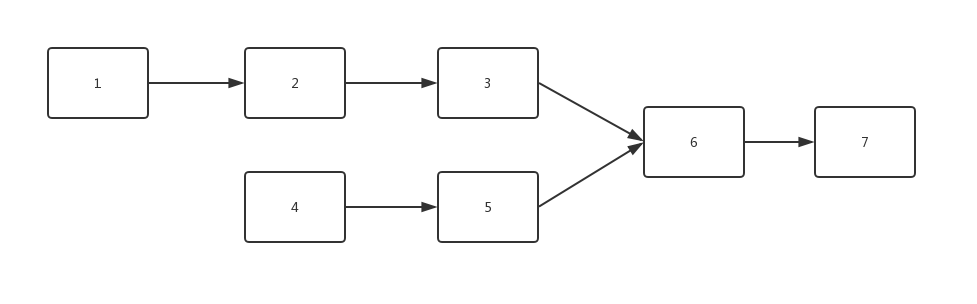

### 两个链表的第一个公共结点

#### 题目描述
输入两个链表，找出它们的第一个公共结点。

#### 节点类：

```java
public class ListNode {
	int val;
	ListNode next = null;

	ListNode(int val) {
		this.val = val;
	}
}
```

#### 分析
首先要理解什么是公共节点，并不是两个节点的值相同就是公共节点。
而是在第一链表和第二链表中都存在一个节点，该节点往后的子链表在两个链表中是相同的。

如下图中链表6 - 7就是两个链表的公共链表，而节点6就是第一个公共节点。


#### 方法一
最直观就是暴力法，在第一链表上顺序遍历每个节点，每遍历到一个节点，就在第二个链表上顺序遍历每个节点。如果在第二个链表上有一个节点和第一个链表上的节点一样，则说明两个链表在这个节点上重合，但是这种方法的复杂度为O(m * nm∗n)（第一个链表长度为m，第二个链表的长度为n）

#### 方法二
如果两个链表存在公共节点，那么公共节点出现在两个链表的尾部。如果我们从两个链表的尾部开始往前比较，那么最后一个相同的节点就是我们要找的节点。但是这两个链表是单向的，要实现尾节点最先比较，我们可以借助两个辅助栈。分别将两个链表的节点放入两个栈中，这样栈顶就是两个链表的尾节点，比较两个栈顶节点是否相同，如果相同，将栈顶弹出比较下一个栈顶，直到找到最后一个相同的栈顶。时间复杂度O(m + n)。

```java
public ListNode FindFirstCommonNode(ListNode pHead1, ListNode pHead2) {
    if(pHead1 == null || pHead2 == null) {
        return null;
    }
    Stack<ListNode> pStack1 = new Stack<ListNode>();
    Stack<ListNode> pStack2 = new Stack<ListNode>();
    while(pHead1 != null) {
        pStack1.add(pHead1);
        pHead1 = pHead1.next;
    }
    while(pHead2 != null) {
        pStack2.add(pHead2);
        pHead2 = pHead2.next;
    }
    ListNode temp = null;
    while(!pStack1.isEmpty() && !pStack2.isEmpty()) {
        ListNode pH1 = pStack1.pop();
        ListNode pH2 = pStack2.pop();
        if(pH1.val == pH2.val) {
            temp = pH1;		
        }
        else {
            break;
        }
    }
    return temp;
}
```

#### 方法三
先获得两个链表的长度，然后在较长的链表上先走若干步(两链表长度之差)，接着同时在两个链表上遍历，找到的第一个相同的节点就是他们的第一个公共节点。时间复杂度O(m + n)。

```java
public ListNode FindFirstCommonNode_2(ListNode pHead1, ListNode pHead2) {
    if(pHead1 == null || pHead2 == null) {
        return null;
    }

    int pHead1Length = getListLength(pHead1);
    int pHead2Length = getListLength(pHead2);

    int gap = pHead1Length - pHead2Length;
    ListNode tempList1 = pHead1;
    ListNode tempList2 = pHead2;

    if(pHead2Length > pHead1Length) {
        tempList1 = pHead2;
        tempList2 = pHead1;
        gap = pHead2Length - pHead1Length;
    }

    for (int i = 0; i < gap; i++) {
        tempList1 = tempList1.next;
    }

    while((tempList1 != null) && (tempList2 != null) && (tempList1.val != tempList2.val)) {
        tempList1 = tempList1.next;
        tempList2 = tempList2.next;
    }

    return tempList1;

}

public int getListLength(ListNode list) {
    int number = 0;
    while(list != null) {
        ++number;
        list = list.next;
    }
    return number;
}
```

#### 方法四
用两个指针扫描”两个链表“，最终两个指针到达 null 或者到达公共结点。

```java
public ListNode FindFirstCommonNode_3(ListNode pHead1, ListNode pHead2) {
    if(pHead1 == null || pHead2 == null) {
        return null;
    }
    ListNode temp1 = pHead1;
    ListNode temp2 = pHead2;
    while(temp1 != temp2) {
        temp1 = (temp1 == null ? pHead2 : temp1.next);

        temp2 = (temp2 == null ? pHead1 : temp2.next);
        System.out.println(pHead1.val);
    }
    return temp1;
}
```