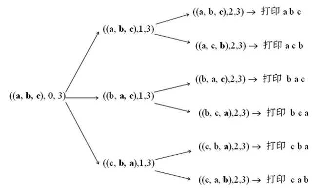

### 题目描述

输入一个字符串，打印出该字符串中字符的所有排列。

例如输入字符串abc，则输出由字符a、b、c 所能排列出来的所有字符串：
 abc、acb、bac、bca、cab 和 cba。

### 分析和解法

这是典型的递归求解问题，递归算法有四个特性：

- 必须有可达到的终止条件，否则程序陷入死循环
- 子问题在规模上比原问题小
- 子问题可通过再次递归调用求解
- 子问题的解应能组合成整个问题的解

### 递归实现

对于字符串的排列问题：
 如果能生成n-1个元素的全排列，就能生成n个元素的全排列。对于只有一个元素的集合，可以直接生成全排列。所以全排列的递归终止条件很明确，只有一个元素时。我们可以分析一下全排列的过程：

- 首先，我们固定第一个字符a，求后面两个字符bc的排列
- 当两个字符bc排列求好之后，我们把第一个字符a和后面的b交换，得到bac，接着我们固定第一个字符b，求后面两个字符ac的排列
- 现在是把c放在第一个位置的时候了，但是记住前面我们已经把原先的第一个字符a和后面的b做了交换，为了保证这次c仍是和原先处在第一个位置的a交换，我们在拿c和第一个字符交换之前，先要把b和a交换回来。在交换b和a之后，再拿c和处于第一位置的a进行交换，得到cba。我们再次固定第一个字符c，求后面两个字符b、a的排列
- 既然我们已经知道怎么求三个字符的排列，那么固定第一个字符之后求后面两个字符的排列，就是典型的递归思路了

下面这张图很清楚的给出了递归的过程：

 

**源代码如下：**

```cpp
#include <iostream>
#include <cstring>

using namespace std;

void AllPermutation(char* perm, int from, int to)
{
    if(from > to)
        return;
            
    if(from == to)     //打印当前排列 
    {
        static int count = 1;    //局部静态变量，用来统计全排列的个数  
        cout << count++ << ":" << perm;
        cout << endl;
    }
    if(from < to)     //用递归实现全排列 
    {
        for(int j = from; j <= to; j++)    //第j个字符分别与它后面的字符交换就能得到新的排列
        {
                swap(perm[j], perm[from]);
            //cout<<0;
            AllPermutation(perm, from + 1, to);
            //cout<<1;
            swap(perm[j], perm[from]);
            //cout<<2;
            
        }
    }
}

int main()
{
    char str[100];
    cin >> str;
    AllPermutation(str, 0, strlen(str) - 1);
    return 0;
}
```

但是如果输入里有重复字符又该如何去掉呢？

由于全排列就是从第一个数字起，每个数分别与它后面的数字交换，我们先尝试加个这样的判断——如果一个数与后面的数字相同那么这两个数就不交换了。例如abb，第一个数与后面两个数交换得bab，bba。然后abb中第二个数和第三个数相同，就不用交换了。但是对bab，第二个数和第三个数不同，则需要交换，得到bba。由于这里的bba和开始第一个数与第三个数交换的结果相同了，因此这个方法不行。

换种思维，对abb，第一个数a与第二个数b交换得到bab，然后考虑第一个数与第三个数交换，此时由于第三个数等于第二个数，所以第一个数就不再用与第三个数交换了。再考虑bab，它的第二个数与第三个数交换可以解决bba。此时全排列生成完毕！

这样，我们得到在全排列中去掉重复的规则：

> 去重的全排列就是从第一个数字起，每个数分别与它后面非重复出现的数字交换。

**源代码如下：**

```csharp
#include <iostream>
#include <cstring>

using namespace std;

//在[from, to]区间中是否有字符与下标为from的字符相等  
bool IsSwap(char* from, char* to)
{
    char* p;
    for(p = from; p < to; p++)
    {
        if(*p == *to)
            return false;   
    }   
    return true;
} 

void AllPermutation(char* perm, int from, int to)
{
    if(from > to)
        return;
            
    if(from == to)     //打印当前排列 
    {
        static int count = 1;    //局部静态变量，用来统计全排列的个数  
        cout << count++ << ":" << perm;
        cout << endl;
    }
    if(from < to)     //用递归实现全排列 
    {
        for(int j = from; j <= to; j++)    //第j个字符分别与它后面的字符交换就能得到新的排列
        {
            if(IsSwap((perm + j), (perm + to)))
            {
                swap(perm[j], perm[from]);
                //cout<<0;
                AllPermutation(perm, from + 1, to);
                //cout<<1;
                swap(perm[j], perm[from]);
                //cout<<2;
            }
        }
    }
}

int main()
{
    char str[100];
    cin >> str;
    AllPermutation(str, 0, strlen(str) - 1);
    return 0;
}
```

**分析：**时间复杂度为O（n!）。这个解法不难想到，但是需要注意去除重复的那块处理，用最后一位与前面的每个字符比较，如果相等，就不交换，否则交换。

### 字典序排列

首先，咱们得清楚什么是字典序。根据维基百科的定义：给定两个偏序集A和B,(a,b)和(a′,b′)属于笛卡尔集 A × B，则字典序定义为

> (a,b) ≤ (a′,b′) 当且仅当 a < a′ 或 (a = a′ 且 b ≤ b′)。

所以给定两个字符串，逐个字符比较，那么先出现较小字符的那个串字典顺序小，如果字符一直相等，较短的串字典顺序小。例如：abc < abcd < abde < afab。

那有没有这样的算法，使得

- 起点： 字典序最小的排列, 1-n , 例如12345
- 终点： 字典序最大的排列，n-1, 例如54321
- 过程： 从当前排列生成字典序刚好比它大的下一个排列

答案是肯定的：有，即是STL中的next_permutation算法。

在了解next_permutation算法是怎么一个过程之前，咱们得先来分析下“下一个排列”的性质。

- 假定现有字符串(A)x(B)，它的下一个排列是：(A)y(B’)，其中A、B和B’是“字符串”(可能为空），x和y是“字符”，前缀相同，都是A，且一定有y > x。
- 那么，为使下一个排列字典顺序尽可能小，必有：
  - A尽可能长
  - y尽可能小
  - B’里的字符按由小到大递增排列

现在的问题是：找到x和y。怎么找到呢？咱们来看一个例子。

比如说，现在我们要找21543的下一个排列，我们可以从左至右逐个扫描每个数，看哪个能增大（至于如何判定能增大，是根据如果一个数右面有比它大的数存在，那么这个数就能增大），我们可以看到最后一个能增大的数是：x = 1。而1应该增大到多少？1能增大到它右面比它大的那一系列数中最小的那个数，即：y = 3，故此时21543的下一个排列应该变为23xxx，显然 xxx(对应之前的B’）应由小到大排，于是我们最终找到比“21543”大，但字典顺序尽量小的23145，找到的23145刚好比21543大。

由这个例子可以得出next_permutation算法流程为：
 **next_permutation算法**

- 定义
  - 升序：相邻两个位置ai < ai+1，ai 称作该升序的首位
- 步骤（二找、一交换、一翻转）
  - 找到排列中最后（最右）一个升序的首位位置i，x = ai
  - 找到排列中第i位右边最后一个比ai 大的位置j，y = aj
  - 交换x，y
  - 把第(i+ 1)位到最后的部分翻转

还是拿上面的21543举例，那么，应用next_permutation算法的过程如下：

- x = 1；
- y = 3
- 1和3交换，得23541
- 翻转541，得23145

23145即为所求的21543的下一个排列。

**源代码如下：**

```cpp
#include <iostream>
#include <cstring>
#include <algorithm>
#include <cassert>

using namespace std;

//反转区间
void Reverse(char* begin, char* end)
{
    while(begin < end)
        swap(*begin++, *end--);
}  

//下一个排列
bool NextPermutation(char* str)
{
    assert(str);    //检查空指针
    
    char *p, *q, *pFind;
    char *pEnd = str + strlen(str) - 1;
    if(str == pEnd)
        return false;
    p = pEnd;
    while(p != str)
    {
        q = p;
        p--;
        if(*p < *q)    //找升序的相邻两数，前一个数即替换数
        {
            //从后向前找比替换点大的第一个数
            pFind = pEnd;
            while(*pFind <= *p) 
                --pFind;
            swap(*p, *pFind);
            //替换点后的数全部反转
            Reverse(q, pEnd);
            return true; 
        } 
    }
    //如果没有找到下一个排列，全部反转后返回false
    Reverse(str, pEnd);   
    return false; 
}

int cmp(const void *a,const void *b)  
{  
    return int(*(char *)a - *(char *)b);  
}

int main()
{
    char str[100];
    cin >> str;
    int count = 1;
    qsort(str, strlen(str), sizeof(char), cmp);
    do
    {
        cout << count++ << ":" << str << endl;
    }while(NextPermutation(str));
    return 0;
}
```

**分析：**时间复杂度为O（n!）。这个版本是可以有重复字符的。

### 特别注意

一定要注意边界条件和判断条件，到底是 > 还是 >= ，会影响结果。