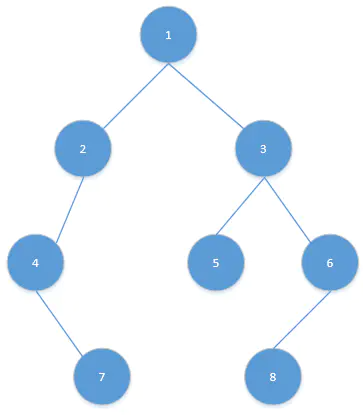

### 题目概述

- 输入某二叉树的前序遍历和中序遍历的结果，请重建出该二叉树。假设输入的前序遍历和中序遍历的结果中都不含重复的数字。例如输入前序遍历序列{1,2,4,7,3,5,6,8}和中序遍历序列{4,7,2,1,5,3,8,6}，则重建二叉树并返回。

### 解题思路

1. 前序排列顺序为 **根-左-右**，中序排列为**左-根-右**。
2. 那么如题根为1。
3. 则根据中序遍历序列则可以得到左子树{4,7,2,}和右子树{5,3,8,6}。
4. 又根据前序遍历则可以得到左子树的根为2，右子树的根为3。
5. 重复3,4步。
6. 直到左右子树皆为空时即可重建二叉树如图。

 

这是种递归思路，将问题子树问题递归到最后只有三个元素的子树上。

### 代码

```java
public class Solution {
    public TreeNode reConstructBinaryTree(int [] pre,int [] in) {
        TreeNode root =re(pre,0,pre.length-1,in,0,in.length-1);//传入前序遍历和中序遍历的序列，返回还原的二叉树。
        return root;
    }
    
    public TreeNode re(int[] pre,int startPre,int endPre,int[] in,int startIn,int endIn){
        if(startPre>endPre||startIn>endIn){//判定是否序列是否便利完。
            return null;
        }
        TreeNode root =new TreeNode(pre[startPre]);//存入节点
        for(int i=startIn;i<=endIn;i++){//从中序遍历开始，寻找和根节点相同的元素。
            if(in[i]==pre[startPre]){//找到了之后分为左右子树，递归进行查找。
                root.left=re(pre,startPre+1,startPre+i-startIn,in,startIn,i-1);
                root.right=re(pre,startPre+i-startIn+1,endPre,in,i+1,endIn);
            }
        }
        return root;
    }
}
```