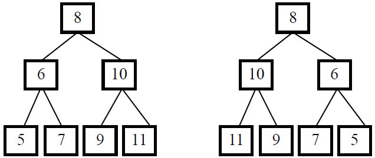
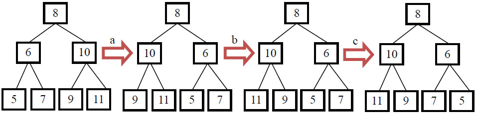

### 题目

请完成一个函数，输入一个二叉树，该函数输出它的镜像。例如下图所示，左图是原二叉树，而右图则是该二叉树的镜像。



　该二叉树节点的定义如下，采用C#语言描述：

```c#
public class BinaryTreeNode
{
    public int Data { get; set; }
    public BinaryTreeNode leftChild { get; set; }
    public BinaryTreeNode rightChild { get; set; }

    public BinaryTreeNode(int data)
    {
        this.Data = data;
    }

    public BinaryTreeNode(int data, BinaryTreeNode left, BinaryTreeNode right)
    {
        this.Data = data;
        this.leftChild = left;
        this.rightChild = right;
    }
}
```

### 解题思路

#### 核心步骤

1. 先序遍历原二叉树的每个节点，如果遍历到的结点有子结点，就交换它的两个子结点。
2. 递归遍历每个节点的子节点，同样，如果遍历到的子节点有子节点，就交换它的两个子节点。
3. **当交换完所有非叶子结点的左右子结点之后，就得到了树的镜像**。下图展示了求二叉树的镜像的过程：

#### 代码实现

##### 递归版实现

```java
public static void SetMirrorRecursively(BinaryTreeNode root)
{
    if (root == null || (root.leftChild == null && root.rightChild == null))
    {
        return;
    }

    BinaryTreeNode tempNode = root.leftChild;
    root.leftChild = root.rightChild;
    root.rightChild = tempNode;

    if (root.leftChild != null)
    {
        // 递归调整左子树为镜像
        SetMirrorRecursively(root.leftChild);
    }

    if (root.rightChild != null)
    {
        // 递归调整右子树为镜像
        SetMirrorRecursively(root.rightChild);
    }
}
```

##### 循环版实现

```java
    public static void SetMirrorIteratively(BinaryTreeNode root)
    {
        if (root == null)
        {
            return;
        }

        Stack<BinaryTreeNode> stack = new Stack<BinaryTreeNode>();
        stack.Push(root);

        while (stack.Count > 0)
        {
            BinaryTreeNode node = stack.Pop();

            BinaryTreeNode temp = node.leftChild;
            node.leftChild = node.rightChild;
            node.rightChild = temp;

            if (node.leftChild != null)
            {
                stack.Push(node.leftChild);
            }

            if (node.rightChild != null)
            {
                stack.Push(node.rightChild);
            }
        }
    }
```