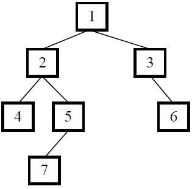

### 题目说明

输入一棵二叉树的根结点，求该树的深度。从根结点到叶结点依次经过的结点（含根、叶结点）形成树的一条路径，最长路径的长度为树的深度。例如下图中的二叉树的深度为4，因为它从根结点到叶结点最长的路径包含4个结点（从根结点1开始，经过结点2和结点5，最终到达叶结点7）。

二叉树的结点定义如下，这里使用C#语言描述：

```c#
public class BinaryTreeNode
{
    public int Data { get; set; }
    public BinaryTreeNode LeftChild { get; set; }
    public BinaryTreeNode RightChild { get; set; }

    public BinaryTreeNode(int data)
    {
        this.Data = data;
    }

    public BinaryTreeNode(int data, BinaryTreeNode left, BinaryTreeNode right)
    {
        this.Data = data;
        this.LeftChild = left;
        this.RightChild = right;
    }
}
```

### 解题思路

1. 如果一棵树只有一个结点，它的深度为1。
2. 如果根结点只有左子树而没有右子树，那么树的深度应该是其左子树的深度加1；同样如果根结点只有右子树而没有左子树，那么树的深度应该是其右子树的深度加1。
3. 如果既有右子树又有左子树，那该树的深度就是其左、右子树深度的较大值再加1。

比如在上图的二叉树中，根结点为1的树有左右两个子树，其左右子树的根结点分别为结点2和3。根结点为2的左子树的深度为3，而根结点为3的右子树的深度为2，因此根结点为1的树的深度就是4。

```java
public static int GetTreeDepth(BinaryTreeNode root)
{
    if (root == null)
    {
        return 0;
    }

    int left = GetTreeDepth(root.LeftChild);
    int right = GetTreeDepth(root.RightChild);

    return left >= right ? left + 1 : right + 1;
}
```