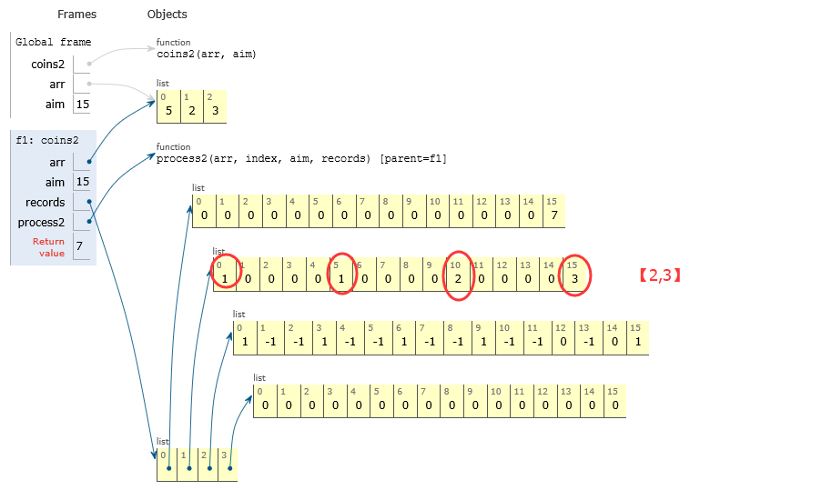
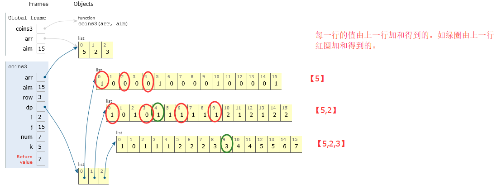

### 换钱的方法数

给定数组arr，arr中所有的值都为整数且不重复。每个值代表一种面值的货币，每种货币有无数张，再给定一个整数aim代表要找的钱数，求换钱的方法有多少种。

### 思路1

**暴力递归，最坏情况下时间O(aim^N)，N表示数组的长度**

首先介绍暴力递归的方法。如果arr = [5, 10, 25, 1]，aim = 1000，分析过程如下：

```bash
用０张５元的货币，让[10, 25, 1]组成剩下的1000，最终方法数记为res1。
用１张５元的货币，让[10, 25, 1]组成剩下的995，最终方法数记为res2。
用２张５元的货币，让[10, 25, 1]组成剩下的990，最终方法数记为res3。
……
用201张５元的货币，让[10, 25, 1]组成剩下的0，最终方法数记为res201。
```


那么`res1 + res2 + res3 + …… +res201`的值就是中的方法数。


```python
#暴力递归方法
def coins1(arr, aim):
    def process1(arr, index, aim):
        if index == len(arr):
            return 1 if aim == 0 else 0
        else:
            res = 0
            for i in range(0, aim//arr[index]+1):
                res += process1(arr, index+1, aim-arr[index]*i)
        return res


    if arr == None or len(arr) == 0 or aim < 0:
        return 0
    return process1(arr, 0, aim)
```

### 思路2

**记忆搜索：时间复杂度为O(N*aim^2)，空间复杂度O(N*aim)。**

采用一个字典存储计算过的结果，暴力递归会重复计算结果。比如使用0张5元+1张10元的情况和使用2张5元+0张10元的情况，都需要求[25, 1]组成剩下的990的方法数。记忆搜索就是使用一张记录表将递归过程中的结果进行记录，当下次再遇到同样的递归过程，就直接使用表中的数据。

 

第三行：圈出的

第一步：当0个5：当0个2，只用【3】构成15的方法：1个

　　　　　　　　 1个2，只用【3】构成13的方法：-1个【不可能】

　　　　　　　　 2个2，……

　　　　　　　　 ……

　　　　　　　　 7个2……


第三行：圈出的

第二步：当1个5时，当0个2，只用【3】构成10：-1个

　　　　　　　　　 1个2，只用【3】构成8：-1个

　　　　　　　　　 ……

　　　　　　　　　 5个2，只用【3】构成0：1个



第二行：

当0个5时：只用【2，3】构成15有3种方法

当1个5时：只用【2，3】构成10有2种方法

当2个5时：只用【2，3】构成5有1种方法

当3个5时：只用【2，3】构成0有1种方法

****

 

第一行：结果，用【5，2，3】构成15有7种方法

#### 代码

```python
def coins2(arr, aim):
    def process2(arr, index, aim, records):
        if index == len(arr):
            return 1 if aim == 0 else 0
        else:
            res = 0
            for i in range(0, aim//arr[index]+1):
                mapValue = records[index+1][aim-arr[index]*i]
                if mapValue != 0:
                    res += mapValue if mapValue != -1 else 0
                else:
                    res += process2(arr, index+1, aim-arr[index]*i, records)
        records[index][aim] = -1 if res == 0 else res
        return res


    if arr == None or len(arr) == 0 or aim < 0:
        return 0
    records = [[0 for i in range(aim+1)] for j in range(len(arr)+1)]
    return process2(arr, 0, aim, records)
arr = [5,2,3]
aim = 15
res1 = coins2(arr,aim)
```

 ### 思路3

**动态规划：时间O（M* aim^2)，空间O（M * aim）**



 

**为何绿圈等于上一行红圈的加和？即`num += dp[i-1][j-arr[i] * k] `**

比如绿圈的第二行第5列那个1：只用【5，2】

上一行红圈表示只用【5】构成0，2，4的方法数为1，0，0

则当用0个2时，对应【5】构成4方法数为0

当用1个2时，对应【5】构成2方法数为0

当2个2时，对应【5】构成0方法数为1

#### 代码

```python
def coins3(arr, aim):
    if arr == None or len(arr) == 0 or aim < 0:
        return 0
    row = len(arr)
    dp = [[0 for i in range(aim+1)]for j in range(row)]
    for i in range(row):
        dp[i][0] = 1
    for j in range(1, aim//arr[0]+1):
        dp[0][arr[0]*j] = 1
    for i in range(1, row):
        for j in range(1, aim+1):
            num = 0
            for k in range(j//arr[i]+1):
                num += dp[i-1][j-arr[i]*k]
            dp[i][j] = num
    return dp[row-1][aim]
```

### 思路4

**动态规划时间的优化：时间O（M * aim)，空间O（M * aim）**

思路3中的第三步循环k可省略。

```bash
for k in range(j//arr[i]+1):
     num += dp[i-1][j-arr[i]*k] 即

dp[i][j] = dp[i - 1][j] + dp[i - 1][j - arr[i]] + dp[i-1][j - 2 * arr[i]] + … dp[i - 1][j - k * arr[i]]

等价于

dp[i][j] = dp[i - 1][j] + dp[i][j - arr[i]]
```

****

#### 代码

```python
def coins4(arr, aim):
    if arr == None or len(arr) == 0 or aim < 0:
        return 0
    row = len(arr)
    dp = [[0 for i in range(aim+1)] for j in range(row)]
    for i in range(row):
        dp[i][0] = 1
    for j in range(1, aim//arr[0]+1):
        dp[0][arr[0]*j] = 1
    for i in range(1,row):
        for j in range(1, aim+1):
            dp[i][j] = dp[i-1][j]
            dp[i][j] += dp[i][j-arr[i]] if j-arr[i] >= 0 else 0
    return dp[row-1][aim]
```

### 思路5

**动态规划空间的优化：时间O（M * aim)，空间O(aim)。**

```python
def coin5(arr,aim):
    if not arr or not aim:
        return 0
    dp = [0] * (aim + 1)
    for i in range(0,aim+1,arr[0]):
        dp[i] = 1
    for i in range(1,len(arr)):
        for j in range(1,aim+1):
            dp[j] += dp[j-arr[i]] if j - arr[i] >= 0 else 0
    return dp[-1]
arr = [5,2,3]
aim = 15
coin5(arr,aim)
```