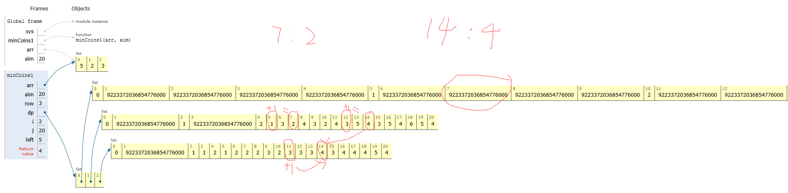

### 题目

给定数组arr,arr中所有的值都为正数且不重复。每个值代表一种面值的货币，每种面值的货币可以使用任意张，再给定一个整数aim代表要找的钱数，求组成aim的最少货币数。

### 示例

* arr[5,2,3], aim=20

  > 4张5元可以组成20,并且是最小的，所以返回4

* arr[5,2,3], aim=0。
  
  > 不用任何货币就可以组成0元，这里返回0.
  
* arr[5,2,3], ami=4
  
  > 这里无法组成返回-1

### 思路

**时间和空间都为O（M*aim)【len(arr) = M 】**

dp 矩阵为：大小为M * aim

dp[i][j]的含义是在可以任意使用arr[0…i]货币的情况下，组成j所需的最小张数，矩阵的每一行和每一列可以先确定，其他的位置`dp[i][j] = min( dp[i-1][j] , dp[i][j-arr[i]]+1)。`

dp的第一行表示：只用 5 来分别构成 0……20 最少要多少张，比如 5 需要 1张，10需要2张，……构不成的赋系统最大值，最后返回-1。

dp的第二行表示：只用5和2分别构成0到20 最少要多少张。

dp的第三行表示：只用5，2，3分别构成0到20最少要多少张。



 

### dp矩阵的构建

**初始化系统最大值**

- 第一列都为0，因为0不需要任何币来构成。
- 第一行：能被5整除的赋值，值为整除的数。比如：5赋值1，10赋值2，15赋值3，20赋值4。
- 第二行、第三行……：

  1. 比如：dp 第2行第7列的值 2 是根据

  2. dp [7-2] +1 = 1 +1 =2来的，即【7可以由1个5和1个2组成】，

  3. 但是还要看第一行7列的值是不是更小，即 `dp[i][j] = min(dp[j - arr[i]] + 1，dp [i-1][j])，dp[j - arr[i]] + 1`不能是系统最大值。


### 代码1

```python
import sys
def minCoins1(arr, aim):
    if arr == None or len(arr) == 0 or aim < 0:
        return -1
    row = len(arr)
    dp = [[sys.maxsize for i in range(aim+1)] for j in range(row)]
    for i in range(row):
        dp[i][0] = 0
    for j in range(1, aim+1):
        if j % arr[0] == 0:
            dp[0][j] = j // arr[0]
    for i in range(1, row):
        for j in range(1, aim+1):
            left = sys.maxsize
            if j - arr[i] >= 0 and dp[i][j-arr[i]] != sys.maxsize:
                left = dp[i][j-arr[i]] + 1
            dp[i][j] = min(left, dp[i-1][j])
    return dp[row-1][aim] if dp[row-1][aim] != sys.maxsize else -1
arr = [5,2,3]
aim = 20
minCoins1(arr, aim)
```

### 代码2

> 时间为O（M*aim)【len(arr) = M 】，空间为O（aim+1)，dp 大小为 aim+1的列表

```python
#经过空间压缩的动态规划
def minCoins2(arr, aim):
    if arr == None or len(arr) == 0 or aim < 0:
        return -1
    row = len(arr)
    dp = [sys.maxsize for i in range(aim+1)]
    dp[0] = 0
    for i in range(1, aim+1):
        if i % arr[0] == 0:
            dp[i] = i // arr[0]
    for i in range(1, row):
        dp[0] = 0
        for j in range(1, aim+1):
            left = sys.maxsize
            if j - arr[i] >= 0 and dp[j-arr[i]] != sys.maxsize:
                left = dp[j-arr[i]] + 1
            dp[j] = min(left, dp[j])
    return dp[aim] if dp[aim] != sys.maxsize else -1
```
