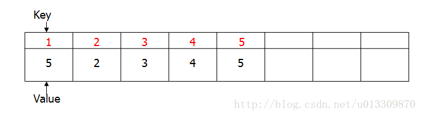

### 题目
找出无序数组中的最长连续序列的长度：例如数组[ 1 , 23 , 2 , 300 , 3 , 9 ,4 , 5 , 90 ]，最长连续序列为：1，2，3，4，5，因此返回长度为 5。

### 解法 1

**时间复杂度O（ nlogn）空间复杂度O（1）**

### 思路

先对数组进行排序，然后从前向后遍历排序后的数组并且记录最长连续子数组长度。

```java
public  int longestcontinueArrays(int arr[])
{
    if(arr==null||arr.length==0)
        return 0;
    int longest=0;
    int len=1;
    Arrays.sort(arr);
    //对数组进行排序
    for(int i=0;i<arr.length;i++)
    {
        if(i+1<arr.length&&arr[i]+1==arr[i+1])
        {
            len++;
            longest=Math.max(longest, len);
            //longest 保存当前最长连续数组的长度。
        } else {
            len=1;
            //当不连续时将len=1
        }
    }
    return longest;

}
```

解法1太常规了，而且时间复杂度最少为 nlogn 有没有更好的方法可以使时间复杂度降到O（n）呢？下面是解法2。

### 解法2

**时间复杂度O（n），空间复杂度O（n）**

使用 hashmap 来保存数组中已经遍历过的元素，key对应元素的值，value表示该元素所在的连续子数组的长度。当遍历到数组的一个元素时有以下四种情况：

1. 如果 hashmap 中存在此元素，则遍历下一个元素。

2. 如果hashmap中不存在元素，则看 hashmap中是否存在此元素的前一个元素，比如说如果遍历到5时，看看hashmap中是否存在 4，如果存在则取该连续子数组的第一个元素，将它value值+1，并将该元素放到hashmap中，value值与第一个元素值相同，都表示该连续子数组的长度。

3. 如果hashmap中存在的该元素的后一个元素，遍历到5时，hashmap中是否存在 6，将次元素加入到后一个连续的子数组中，并且和2中一样，找到子数组的第一个元素和最后一个元素，将它们的value值更新为子数组的长度。

下面是增加一个元素时对应的图：

上图中第一行的1，2代表的是key也就是数组中的元素大小，下一行是key对应的value，因为当前连续数组的长度为2，因此他们的值都是2。现在遍历到元素 3 将3加入到hashmap中后，如下图：

因为3与前面的 1，2构成连续的子数组，长度为3因此更新连续数组的第一个元素的value值，1的value值变为3，同时3的value值也为3。当遍历到元素4的时候，由于4与前面的1，2，3构成长度为4的子数组，因此先更新4的value值为4，1的value值为4，又由于4与后面的5构成了连续的数组，所以更新1的 value 值为5，5的value值为5，如下图：

### 总结

也就是用连续数组的第一个元素和最后一个元素保存数组的长度值，插入一个新的元素到hashmap中时当遇到上面的不同情况时，采用不同的方法更新value值。

### 代码

```java
public  int longestcontinueArrays(int arr[])
{
    if(arr==null||arr.length==0)
        return 0;
    int longest=0;
    HashMap<Integer, Integer> hashMap=new HashMap<Integer, Integer>();
    for(int i=0;i<arr.length;i++)
    {
        //遍历数组，如果hashmap中不包含次元素，将其放入到hashmap中
        if(!hashMap.containsKey(arr[i]))
        {
            hashMap.put(arr[i],1);
            //如果hashmap中存在比当前元素小1的元素，则跟上面一样获得连续子数组的第一个元素，进行更新。
            if(hashMap.containsKey(arr[i]-1))
            {
                //合并arr[i]与前面的子数组。
                longest=Math.max(longest, merge(hashMap, arr[i]-1, arr[i]));
            }
            if(hashMap.containsKey(arr[i]+1))
            {
                //合并arr[i]与后面的连续数组。
                longest=Math.max(longest, merge(hashMap, arr[i], arr[i]+1));
            }
        }
    }               
    return longest;
}
public  int merge(HashMap<Integer, Integer> hashMap,int less,int more)
{
    //合并连续数组，并且更新数组的第一个元素和最后一个元素的value值为合并后的数组的长度。
    int left=less-hashMap.get(less)+1;
    int right=more+hashMap.get(more)-1;
    int len=right-left+1;
    hashMap.put(left, len);
    hashMap.put(right, len);
    return len;
}
```