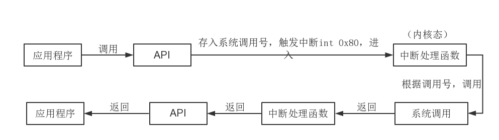

在应用程序中，很多时候都会调用到系统调用来完成一些操作，可是系统调用是在内核态下才能调用，用户态下的应用程序是无法直接调用到的，那么操作系统是怎么处理这一过程的呢？

本文的环境是基于Linux 0.11，没有查证现代操作系统是否有所变化，不过基本思路应该差不多。

### 过程

先来看一张图，有个大概的理解。

首先，应用程序能直接调用的是系统提供的API，这个在用户态（Ring3）下就可做到。

然后相应的API就会将相应的系统调用号保存到eax寄存器中（这一步通过内联汇编实现），之后就是使用int 0x80触发中断（内联汇编），进入到中断处理函数中（该函数是完全由汇编代码编写），这个时候就进入到了内核态（Ring0）了。

在中断处理函数中就会调用与系统调用号相对应的那个系统调用。在这个函数中，会把ds、es这两个寄存器设置为指向内核空间。这样一来，我们无法把数据从用户态中传到内核态啊（如open(const char * filename, int flag, ...)中，filename指针指向的字符串的地址是在用户空间中的，在内核空间相应的地方取的话根本没有该字符串），这该怎么办呢？中断处理函数中的fs寄存器被设置为指向了用户空间，所以问题得以解决。

在系统调用中就是进行相应的操作了，如打开文件、写文件等。

处理完后，将会返回到中断处理函数，返回值保存在eax寄存器中。

从中断处理函数中返回到API，依旧是把返回值保存到eax寄存器中。这个时候就从内核态恢复成用户态。

在API中从eax中取出值，做相应的判断返回不同的值，用以表示操作完成情况。

### 为什么使用int 0x80中断能调用那么多系统调用？

在保护模式下，有各种各样的中断，而系统调用就和0x80号中断绑定。当要调用系统调用时，就触发int 0x80，中断处理函数就通过eax获知想要调用的是哪一个系统调用。这样做的原因是系统调用数量太多，中断号会不够用，所以用一个来集中管理。

操作系统中有一个表，是用来保存各个系统调用函数的地址的。这个表是一个数组，所以通过下标就可以访问到不同函数的地址。故可以做到一个中断号+各样的系统调用号就管理多个系统调用。

### 系统调用三种方法

下面介绍Linux 下三种发生系统调用的方法。

#### 通过 glibc 提供的库函数

glibc 是 Linux 下使用的开源的标准 C 库，它是 GNU 发布的 libc 库，即运行时库。glibc 为程序员提供丰富的 API（Application Programming Interface），除了例如字符串处理、数学运算等用户态服务之外，最重要的是封装了操作系统提供的系统服务，即系统调用的封装。那么glibc提供的系统调用API与内核特定的系统调用之间的关系是什么呢？

- 通常情况，每个特定的系统调用对应了至少一个 glibc 封装的库函数，如系统提供的打开文件系统调用 `sys_open` 对应的是 glibc 中的 `open` 函数；
- 其次，glibc 一个单独的 API 可能调用多个系统调用，如 glibc 提供的 `printf` 函数就会调用如 `sys_open`、`sys_mmap`、`sys_write`、`sys_close` 等等系统调用；
- 另外，多个 API 也可能只对应同一个系统调用，如glibc 下实现的 `malloc`、`calloc`、`free` 等函数用来分配和释放内存，都利用了内核的 `sys_brk` 的系统调用。

举例来说，我们通过 glibc 提供的`chmod` 函数来改变文件 `etc/passwd` 的属性为 444：

```cpp
#include <sys/types.h>
#include <sys/stat.h>
#include <errno.h>
#include <stdio.h>
 
int main()
{
	int rc = 0;
	rc = chmod("/etc/passwd", 0444);
	if (rc == -1)
		fprintf(stderr, "chmod failed, errno = %d\n", errno);
	else
		printf("chmod success!\n");
	return 0;
}
```

在**普通用户下编译运用**，输出结果为：

```bash
chmod failed, errno = 1
```

上面系统调用返回的值为-1，说明系统调用失败，错误码为1，在 /usr/include/asm-generic/errno-base.h 文件中有如下错误代码说明：

```bash
#define EPERM    1         /* Operation not permitted */
```

即无权限进行该操作，我们以普通用户权限是无法修改 /etc/passwd 文件的属性的，结果正确。

#### 使用 syscall 直接调用

使用上面的方法有很多好处，首先你无须知道更多的细节，如 chmod 系统调用号，你只需了解 glibc 提供的 API 的原型；其次，该方法具有更好的移植性，你可以很轻松将该程序移植到其他平台，或者将 glibc 库换成其它库，程序只需做少量改动。
**但有点不足是，如果 glibc 没有封装某个内核提供的系统调用时，我就没办法通过上面的方法来调用该系统调用**。

如我自己通过编译内核增加了一个系统调用，这时 glibc 不可能有你新增系统调用的封装 API，此时我们可以利用 glibc 提供的`syscall` 函数直接调用。该函数定义在 `unistd.h` 头文件中，函数原型如下：

```cpp
long int syscall (long int sysno, ...)
```

- `sysno `是系统调用号，每个系统调用都有唯一的系统调用号来标识。在 `sys/syscall.h` 中有所有可能的系统调用号的宏定义。
- `...`为剩余可变长的参数，为系统调用所带的参数，根据系统调用的不同，可带0~5个不等的参数，如果超过特定系统调用能带的参数，多余的参数被忽略。
- `returnVal`该函数返回值为特定系统调用的返回值，在系统调用成功之后你可以将该返回值转化为特定的类型，如果系统调用失败则返回 -1，错误代码存放在 `errno` 中。

还以上面修改 /etc/passwd 文件的属性为例，这次使用 syscall 直接调用：

```cpp
    ...
	//rc = chmod("/etc/passwd", 0444);
	rc = syscall(SYS_chmod, "/etc/passwd", 0444);
    ...
```

在普通用户下编译执行，输出的结果与上例相同。

#### 通过 int 指令陷入

如果我们知道系统调用的整个过程的话，**应该就能知道用户态程序通过软中断指令`int 0x80` 来陷入内核态（在Intel Pentium II 又引入了`sysenter`指令），参数的传递是通过寄存器，eax 传递的是系统调用号****，ebx、ecx、edx、esi和edi 来依次传递最多五个参数，当系统调用返回时，**返回值存放在 eax 中。**

仍然以上面的修改文件属性为例，将调用系统调用那段写成内联汇编代码：

```cpp
#include <stdio.h>
#include <sys/types.h>
#include <sys/syscall.h>
#include <errno.h>
 
int main()
{
	long rc;
	char *file_name = "/etc/passwd";
	unsigned short mode = 0444;
 
	asm(
		"int $0x80"
		: "=a" (rc)
		: "0" (SYS_chmod), "b" ((long)file_name), "c" ((long)mode)
	);
 
	if ((unsigned long)rc >= (unsigned long)-132) {
		errno = -rc;
		rc = -1;
	}
 
	if (rc == -1)
		fprintf(stderr, "chmode failed, errno = %d\n", errno);
	else
		printf("success!\n");
 
	return 0;
}
```

如果 eax 寄存器存放的返回值（存放在变量 rc 中）在 -1~-132 之间，就必须要解释为出错码（在`/usr/include/asm-generic/errno.h` 文件中定义的最大出错码为 132），这时，将错误码写入 errno 中，置系统调用返回值为 -1；否则返回的是 eax 中的值。

上面程序在 32位Linux下以普通用户权限编译运行结果与前面两个相同！，在64位环境下则显示chmode failed, errno = 22：参数无效。