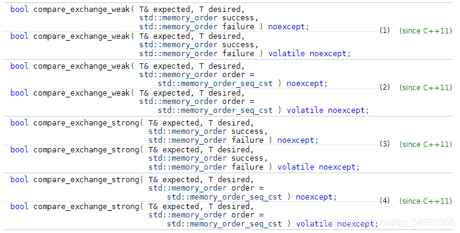

### 原子操作

我们通常语义下是指不能被进一步分割的最小粒子，而在计算机中的原子操作一般是指“不可被中断的一个或一系列操作”，或者说是：多个线程执行一个操作，其中任何一个线程要么完全执行完这些操作，要么没有执行这个操作的任何一个步骤。

 在单核处理器系统中，能够在单条指令中完成的操作都可以认为是“原子操作”，因为在单条指令的执行过程中不会被中断。但是在多核时代，可能同时运行多个独立的CPU，即使是可以在单个指令中完成的操作也有可能会被干扰。举个例子，decl指令（递减指令），它可以分为三步：读，递减，写，这个过程涉及两个内存操作。如果有多个CPU运行的多个线程同时对同一块内存执行这个指令，出现的情况是无法预测的。当然为了解决这种多核环境下的并发问题，最常见的解决办法是加锁，限制同一时间只能有一个进程或线程访问临界资源。但是这种限制就会带来了一些性能上的损失，不能充分利用多核性能，所以就引入了无锁技术。

### 无锁技术

目前大部分高性能服务器软件都是运行在多核服务器上的，在高并发环境下锁竞争机制有时会比数据拷贝，上下文切换等更伤害系统的性能。在英特尔DPDK数据平面开发套件中实现了一种可以在不加锁的情况下可以安全地并行访问临界资源的技术--无锁队列。感兴趣的可以参考DPDK文档。

这种无锁队列主要是基于CAS（Compare And Swap）原理：对比交换原理。CAS是一个原子指令，用于在多线程环境中实现同步。 它将一个内存位置上的内容与一个给定的值进行比较，只有它们相同时才将该内存位置的内容修改为新的给定值。 这个过程是作为单个原子操作完成的。 原子性保证了了这个新值是最新的，意思是说这个新值在被读取后到操作完成这个过程中不会被其它线程修改； 如果与此同时该值已被另一个线程更新，则写入将失败。 操作的结果必须表明它是否执行了替换，或者说是否成功完成了这个操作；

本文目的是介绍c++中原子类atomic的CAS操作。

### C++中的CAS

为了直入主题，这里不再详细介绍C++ atomic类，而是直接介绍可以用于实现CAS的接口。

```c++
std::atomic<T>::compare_exchange_weak
std::atomic<T>::compare_exchange_strong
```

具体定于如下：

这些函数会原子地执行这些操作：对比对象的值和expected的值，如果相等就会把对象的值替换为desired的值；否则，就把expected的值更新为原子对象的最新值。

* `expected`：是一个引用，表示所期待的原子对象的值。 如果对比失败，就把expected的值更新为原子对象的最新值。

* `desired`：如果对比成功，保存到原子对象中的值
* `success`：指定对比成功时的执行读-修改-写操作的内存同步顺序
* `failure`：   指定对比失败时的执行读-修改-写操作的内存同步顺序；不能std::memory_order_release or std::memory_order_acq_rel

如果修改成功就返回true，否则返回false。

当需要在一个循环中使用对比转换是，weak版本将在某些平台上产生更好的性能。

**strong版本的例子：**

```c++
#include <atomic>
#include <iostream>

std::atomic<int>  ai;

int  tst_val= 4;
int  new_val= 5;
bool exchanged= false;

void valsout()
{
    std::cout << "ai= " << ai
	      << "  tst_val= " << tst_val
	      << "  new_val= " << new_val
	      << "  exchanged= " << std::boolalpha << exchanged
	      << "\n";
}

int main()
{
    ai= 3;
    valsout();

    // tst_val != ai   ==>  tst_val is modified
     //这个时候由于ai为3，tst_val为4，所以对比就会失败，那么tst_val就会被修改为3
    exchanged= ai.compare_exchange_strong( tst_val, new_val );
    valsout();
    //这个时候对比就会成功，那么ai的值就会被修改为new_val
    // tst_val == ai   ==>  ai is modified
    exchanged= ai.compare_exchange_strong( tst_val, new_val );
    valsout();

}
```

输出如下：

```c++
ai= 3  tst_val= 4  new_val= 5  exchanged= false
ai= 3  tst_val= 3  new_val= 5  exchanged= false
ai= 5  tst_val= 3  new_val= 5  exchanged= true
```

**weak示例：**

这个示例实现了一个多线程安全地无锁stack 

```c++
#include <atomic>
#include<thread>
template<typename T>
struct node
{
    T data;
    node* next;
    node(const T& data) : data(data), next(nullptr) {}
};

template<typename T>
class stack
{
    std::atomic<node<T>*> head;
 public:
    void push(const T& data)
    {
      	node<T>* new_node = new node<T>(data);
 	    node<T>* old_head = head.load(std::memory_order_relaxed);
      	// 把head的当前值保存到old_head
	//然后开始把新节点插入到链表作为新的head；开始对比head和old_head的值，
    //但是如果此时head的值已经被改变，则对比就会失败，
    //这种情况可能是其它线程已经插入一个新的节点。这种情况就会把head的新值取出来，然后load到old_head中，更新old_head的值为head的最新值，然后在执行一次。
     do 
      {
         new_node->next = old_head;
      } while(!head.compare_exchange_weak(old_head, new_node,
                                          std::memory_order_release,
                                          std::memory_order_relaxed));

    }
};
stack<int> s;
void push(int c)
{
    for (int i = 0;; i++)
    {
        std::cout << "push:"<<i<<endl;
        s.push(i);
    }
};
int main()
{
    std::thread threads[5];
    std::cout << "Spawning 5 threads...\n";
    for (int i = 0; i < 5; i++) {
        threads[i] = std::thread(push, i);
    }

    for (auto& t : threads) {
        t.join();
    }

}
```

