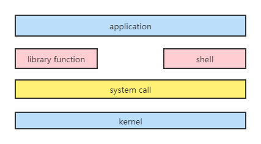
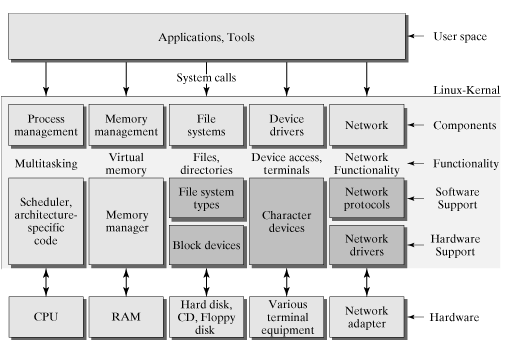

### 一、什么是用户态和内核态？

我们先看一张linux的整体架构图：

 

从图上我们可以看出来通过system call将Linux整个体系分为用户态和内核态（或者说内核空间和用户空间），实际上我们所说的内核态就是kernel。

kernel也是一种软件程序，但是kernel比较特殊。kernel主要特殊在于kernel的功能是用来控制计算器的硬件资源，例如协调CPU资源，分配内存资源，并且提供稳定的环境供给应用程序运行。

kernel也是我们常常所说的内核态，用户态就是提供应用程序运行的空间，为了使应用程序访问到内核管理的资源例如CPU，内存，I/O。内核必须提供一组通用的访问接口，这些接口就叫system call（系统调用）。

打个比方，可能比较好理解，如我们应用层写代码，常常使用到的创建对象实例，如`Object obj = new Object();`。实际上底层是通过`void *malloc(size_t size);`库函数进行内存分配。到malloc这里的层次依旧停留在用户态，kernel又处理不了相关的分配操作，这里就会用到系统调用的`brk()`和`mmap()`函数，通过系统调用函数就能访问到内核管理的资源。

### 二、为什么要有内核态和用户态的区分？

在CPU的所有指令中，有一些指令是非常危险的，如果错用，将导致整个系统崩溃。比如：清内存、设置时钟等。

如果所有的程序都能使用这些指令，那么你的系统一天死机n回就不足为奇了。所以，CPU将指令分为特权指令和非特权指令，对于那些危险的指令，只允许操作系统及其相关模块使用，普通的应用程序只能使用那些不会造成灾难的指令。

### 三、CPU特权级别

Intel的CPU将特权级别分为4个级别：RING0, RING1, RING2, RING3。

Windows只使用其中的两个级别RING0和RING3，RING0只给操作系统用，RING3谁都能用。如果普通应用程序企图执行RING0指令，则Windows会显示“非法指令”错误信息。  

RING0是指CPU的运行级别，RING0是最高级别，RING1次之，RING2更次之。

拿Linux+x86来说，操作系统（内核）的代码运行在最高运行级别RING0上，可以使用特权指令，控制中断、修改页表、访问设备等等。  应用程序的代码运行在最低运行级别上RING3上，不能做受控操作。如果要做，比如要访问磁盘，写文件，那就要通过执行系统调用（函数），执行系统调用的时候，CPU的运行级别会发生从RING3到RING0的切换，并跳转到系统调用对应的内核代码位置执行，这样内核就为你完成了设备访问，完成之后再从RING0返回RING3。这个过程也称作用户态和内核态的切换。

 

举个RING权限的最简单的例子：

一个停止响应的应用程式，它运行在比RING0更低的指令环上，你不必大费周章的想着如何使系统回复运作，这期间，只需要启动任务管理器便能轻松终止它，因为它运行在比程式更低的RING0指令环中，拥有更高的权限，可以直接影响到RING0以上运行的程序，当然有利就有弊，RING保证了系统稳定运行的同时，也产生了一些十分麻烦的问题。比如一些OS虚拟化技术，在处理RING指令环时便遇到了麻烦，系统是运行在RING0指令环上的，但是虚拟的OS毕竟也是一个系统，也需要与系统相匹配的权限。而RING0不允许出现多个OS同时运行在上面，最早的解决办法便是使用虚拟机，把OS当成一个程序来运行。

### 四、内核调用架构图

 

通过上图可以发现，内核控制并且管理硬件资源，包括进程的调度和管理、内存管理、文件系统管理、设备驱动管理、网络管理等等。并且提供应用程序统一的系统调用接口。这种分层的架构，极大的提升了系统的稳定性和扩展性，兼容性。

### 五、用户态和内核态的切换

那么问题又来了，从用户态到内核态到底怎么进入？只能通过系统调用吗？还有其他方式吗？

从用户态到内核态切换可以通过三种方式：

1. 系统调用，这个上面已经讲解过了，在我公众号之前的文章也有讲解过。其实系统调用本身就是中断，但是软件中断，跟硬中断不同。
2. 异常：如果当前进程运行在用户态，如果这个时候发生了异常事件，就会触发切换。例如：缺页异常。
3. 外设中断：当外设完成用户的请求时，会向CPU发送中断信号。这时CPU会 暂停执行下一条即将要执行的指令转而去执行与中断信号对应的处理程序，如果先前执行的指令是用户态下的程序，那么这个转换的过程自然也就发生了由用户态到 内核态的切换。比如硬盘读写操作完成，系统会切换到硬盘读写的中断处理程序中执行后续操作等。

**我们常常讨论的时候，就会说内核态的切换比较耗时，耗时的原因是什么呢？**

Linux下每个进程的栈有两个，一个是用户态栈，一个是内核态栈。在需要从用户态栈切换到内核的时候，需要进行执行栈的转换，保存用户态的状态，包括寄存器状态，然后执行内核态操作，操作完成后要恢复现场，切换到用户态，这个过程是耗时的。这是宏观上看到的东西，还有很多细节值得大家去研究。

最后附上一张详细些的kernel架构图，便于对照学习。

 