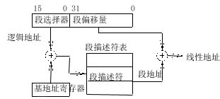
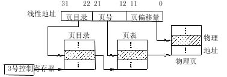
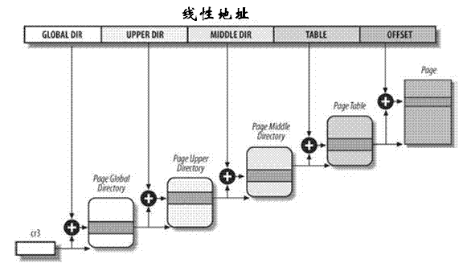

### 简介

现代操作系统的内存管理机制有两种：段式管理和页式管理。

段式内存管理，就是将内存分成段，每个段的起始地址就是段基地址。地址映射的时候，由逻辑地址加上段基地址而得到物理地址。纯粹的段式内存管理的缺点很明显，就是灵活性和效率比较差。首先是段的长度是可变的，这给内存的换入换出带来诸多不便，如何选择一个段的长度是一个棘手的问题；其次进程在运行过程中，可能会扩充地址空间，这就要增加段，从而造成进程的地址空间由很多小段构成，在进程运行过程中，访问不同的段时，就需要频繁切换段基地址；再一点，段式内存管理如果有太多的小段，在释放段的时候，会造成外部碎片。

页式内存管理，内存分成固定长度的一个个页片。地址映射的时候，需要先建立页表，页表中的每一项都记录了这个页的基地址。通过页表，由逻辑地址的高位部分先找到逻辑地址对应的页基地址，再由页基地址偏移一定长度就得到最后的物理地址，偏移的长度由逻辑地址的低位部分决定。一般情况下，这个过程都可以由硬件完成，所以效率还是比较高的。页式内存管理的优点就是比较灵活，内存管理以较小的页为单位，方便内存换入换出和扩充地址空间。

严格说Linux采用段页式内存管理，也就是既分段，又分页。地址映射的时候，先确定对应的段，确定段基地址；段内分页，再找到对应的页表项，确定页基地址；再由逻辑地址低位确定的页偏移量，就能找到最终的物理地址。但是，实际上Linux采用的是页式内存管理。原因是Linux中的段基地址都是0，相当于所有的段都是相同的。这样做的原因是某些体系结构的硬件限制，比如Intel的i386。作为软件的操作系统，必须要符合硬件体系。虽然所有段基地址都是0，但是段的概念在Linux内核中是确实存在的。比如常见的内核代码段、内核数据段、用户态代码段、用户态数据段等。除了符合硬件要求外，段也是有实际意义的。

### x86硬件分段单元：
 

逻辑地址分为两部分组成：段标识符和指定段内相对地址的偏移量。

段描述符：用来存放段起始地址，段大小，存储权限等。
段描述符表：存放段描述的表项。
段寄存器：存放段标识符。6个段寄存器称为cs(代码段寄存器)，ss(栈段寄存器)，ds(数据段寄存器)，es，fs 和gs。
段基地址寄存器：指向段描述符表地址。

### Linux分段机制：
Linux对分段使用非常有限。作为一个跨硬件体系的操作系统，要支持多种硬件体系，而一些硬件体系结构式不支持分段的，Linux把所有段起始地址都设为0。
Linux采用4个段进行寻址，用户态代码段，用户态数据段，内核态代码段，内核态数据段。

### x86分页单元：

x86采用两级页表。
第一级为页目录表，存储在一个4K字节的页中，每个表项包含了一个页表的物理地址。线性地址最高的10位(22-31)用来产生第一级表索引，由该索引得到的表项中的内容定位了二级表中的一个表的地址，即下级页表所在的内存块号。
第二级为页表，存储在一个4K字节页中，每个表项包含了一个页的物理地址。线性地址的中间10位(12-21)位进行索引，定位页表表项，获得页的物理地址。页物理地址的高20位与线性地址的低12位形成最后的物理地址。

分页机制由CR0寄存器中的PG位启用。如PG=1，启用分页机制，把线性地址转换为物理地址。如PG=0，禁用分页机制，直接段机制产生的线性地址当作物理地址使用。
页目录表的物理地址存放在CR3寄存器。每个进程有它自己的页全局目录和自己的页表集。当发生进程切换时，Linux把CR3控制寄存器的内容保存在前一个执行进程的描述符中，然后把下一个要执行进程的描述符的值装入CR3寄存器中。这确保了当新进程重新开始在CPU上执行时，分页单元指向一组正确的页表。

### Linux分页机制：

作为一个通用的操作系统，Linux需要兼容各种硬件体系，包括不同位数的CPU。对64位的CPU来说，两级页表仍然太少，一个页表会太大，这会占用太多宝贵的物理内存。Linux采用了通用的四级页表。实际采用几级页表则具体受硬件的限制。

 
四种页表分别称为： 页全局目录、页上级目录、页中间目录、页表。对于32位x86系统，两级页表已经足够了。Linux通过使“页上级目录”位和“页中间目录”位全为0，彻底取消了页上级目 录和页中间目录字段。不过，页上级目录和页中间目录在指针序列中的位置被保留，以便同样的代码在32位系统和64位系统下都能使用。