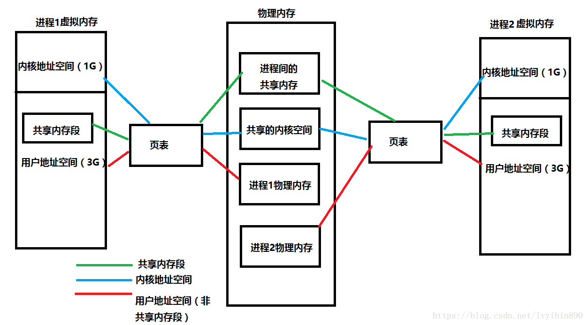
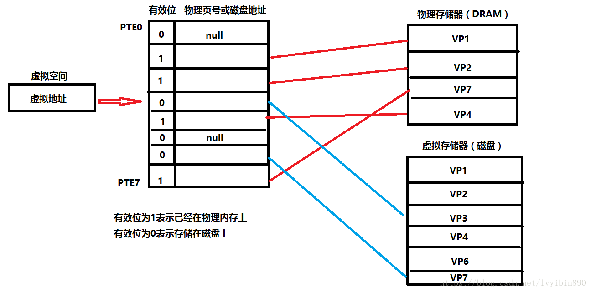

操作系统有虚拟内存与物理内存的概念。在很久以前，还没有虚拟内存概念的时候，程序寻址用的都是物理地址。程序能寻址的范围是有限的，这取决于CPU的地址线条数。比如在32位平台下，寻址的范围是2^32也就是4G。并且这是固定的，如果没有虚拟内存，且每次开启一个进程都给4G的物理内存，就可能会出现很多问题：

* 因为我的物理内存时有限的，当有多个进程要执行的时候，都要给4G内存，很显然你内存小一点，这很快就分配完了，于是没有得到分配资源的进程就只能等待。当一个进程执行完了以后，再将等待的进程装入内存。这种频繁的装入内存的操作是很没效率的
* 由于指令都是直接访问物理内存的，那么我这个进程就可以修改其他进程的数据，甚至会修改内核地址空间的数据，这是我们不想看到的
* 因为内存时随机分配的，所以程序运行的地址也是不正确的。于是针对上面会出现的各种问题，虚拟内存就出来了。

在之前一篇文章中进程分配资源介绍过一个进程运行时都会得到4G的虚拟内存。这个虚拟内存你可以认为，每个进程都认为自己拥有4G的空间，这只是每个进程认为的，但是实际上，在虚拟内存对应的物理内存上，可能只对应的一点点的物理内存，实际用了多少内存，就会对应多少物理内存。

进程得到的这4G虚拟内存是**一个连续的地址空间（这也只是进程认为），而实际上，它通常是被分隔成多个物理内存碎片，还有一部分存储在外部磁盘存储器上，在需要时进行数据交换。**

进程开始要访问一个地址，它可能会经历下面的过程：

1. 每次我要访问地址空间上的某一个地址，都需要把地址翻译为实际物理内存地址
2. 所有进程共享这整一块物理内存，每个进程只把自己目前需要的虚拟地址空间映射到物理内存上
3. 进程需要知道哪些地址空间上的数据在物理内存上，哪些不在（可能这部分存储在磁盘上），还有在物理内存上的哪里，这就需要通过页表来记录
4. 页表的每一个表项分两部分，第一部分记录此页是否在物理内存上，第二部分记录物理内存页的地址（如果在的话）
5. 当进程访问某个虚拟地址的时候，就会先去看页表，如果发现对应的数据不在物理内存上，就会发生缺页异常
6. 缺页异常的处理过程，操作系统立即阻塞该进程，并将硬盘里对应的页换入内存，然后使该进程就绪，如果内存已经满了，没有空地方了，那就找一个页覆盖，至于具体覆盖的哪个页，就需要看操作系统的页面置换算法是怎么设计的了。

关于虚拟内存与物理内存的联系，下面这张图可以帮助我们巩固。

页表的工作原理如下图

1. 我们的cpu想访问虚拟地址所在的虚拟页(VP3)，根据页表，找出页表中第三条的值.判断有效位。 如果有效位为1，DRMA缓存命中，根据物理页号，找到物理页当中的内容，返回。
2. 若有效位为0，参数缺页异常，调用内核缺页异常处理程序。内核通过页面置换算法选择一个页面作为被覆盖的页面，将该页的内容刷新到磁盘空间当中。然后把VP3映射的磁盘文件缓存到该物理页上面。然后页表中第三条，有效位变成1，第二部分存储上了可以对应物理内存页的地址的内容。
3. 缺页异常处理完毕后，返回中断前的指令，重新执行，此时缓存命中，执行1。
4. 将找到的内容映射到告诉缓存当中，CPU从告诉缓存中获取该值，结束。
   